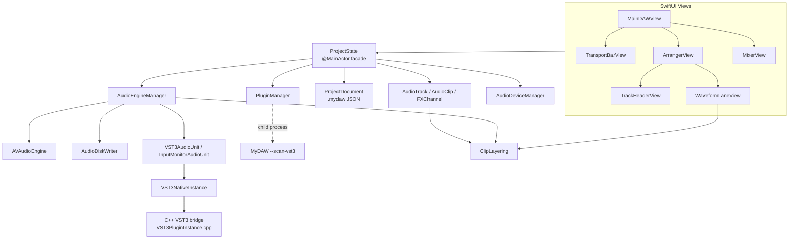

# MyDAW Project Analysis (v3.0)

> Version covered: **3.0** (source as of 2026-10-09)
> Japanese edition: [PROJECT_ANALYSIS_jp.md](PROJECT_ANALYSIS_jp.md)
> Type- and function-level details: [SOURCE_SPECIFICATION_en.md](SOURCE_SPECIFICATION_en.md)

This document explains the MyDAW system as a whole: structure, signal paths, threading, persistence, design decisions and known limitations. It is meant for a developer reading the source for the first time, so they can find where things live and why they are built the way they are.

---

## 1. Overview

MyDAW is a multitrack audio recording, editing and mixing DAW for Apple Silicon Macs. The UI is SwiftUI and audio processing is AVAudioEngine; only VST3 hosting is written in C++ (Steinberg VST3 SDK).

| Item | Details |
| --- | --- |
| Platform | macOS 13 or later / Apple Silicon |
| Languages | Swift (UI, engine), C++17 / Objective-C++ (VST3 bridge) |
| Audio stack | AVAudioEngine, Core Audio HAL, AUAudioUnit (v3 subclasses) |
| Recording format | 24-bit Linear PCM WAV, 44.1 / 48 / 88.2 / 96 kHz, mono / stereo |
| Plug-ins | Audio Unit effects, VST3 effects (VST3s that also exist as an AU are hidden), five built-in effects from MyPlugIn (v3.0) |
| Code size | ~21,500 lines of Swift for the app, ~6,800 lines of Swift for the built-in effects (`Sources/BuiltIn`) / ~900 lines of C++ (`VST3Host/`) |
| Build | `./scripts/build.sh` (builds the VST3 bridge with CMake and links it with `swiftc`) |

### 1.1 Main features

- **Recording**: per-track input channel assignment (mono/stereo), 24-bit WAV written directly to disk, sample-accurate placement. Mono/stereo can also be switched on recorded tracks, without rewriting files (a mono track plays stereo clips as (L+R)/2).
- **Punch in/out**: records only inside the punch range on the ruler. The whole pass is kept on disk and the take is trimmed to the range on stop (leaving handles); while recording, only the part inside the range is shown.
- **Rollback recording**: with the ↺ button on and punch off, recording starts playing N bars (1–16) before the playhead and records from the playhead. Implemented as a one-pass punch-in at the playhead with no punch-out, so the run-up stays in the file as a handle. The R key starts recording like the record button.
- **Input monitoring**: the track's `I` button routes live input through the track's inserts, fader and sends (the recording stays dry).
- **Clip editing**: move (also across tracks), left/right trim, gain, fades with continuously adjustable curves, split, duplicate, delete, mute, normalize, reverse, strip silence, undo/redo, beat snap. Tooltips show fade length, gain and curve while dragging.
- **Selection and editing**: multiple selection (shift/cmd-click, marquee, cmd+A), group moves, range selection (cmd-drag) with delete / crop / split, cut / copy / paste, option-drag to duplicate. Right-click commands apply to every selected clip (right-clicking an unselected clip selects it).
- **Track reordering**: drag a track header to move the track. While dragging, the header and its waveform lane follow the pointer together and a white line shows where it will land. The mixer strips follow the same order.
- **Track folders** (v2.1): one-level folders group tracks, which are shown indented. Folders open and close (a closed folder's tracks are not drawn), move with their tracks, and have a colour, a name and M / S (forcing their tracks muted / soloed, OR-ed with the tracks' own buttons, which come back when turned off). A right-click menu on track headers adds tracks / folders, duplicates tracks / folders and shows the track in the mixer. Duplicating copies the clips (same files), the mixer state, sends and plug-ins with their settings, and advances the number at the end of the name.
- **Display**: waveforms are drawn at the level heard, including fades, crossfades and parts hidden by upper clips, one min–max bar per point from 512- and 64-sample peaks and, zoomed in far, the samples themselves. Wheel / pinch zoom (5–3200 px/s). Auto-scroll during playback can be turned on/off. The timeline is the song's length (clips and end flag, at least 60 s) and is darkened past it; the ruler always fills the view.
- **Overlap layering**: when clips overlap, the most recently added clip wins; boundaries get crossfades (equal power by default, shaped by the upper clip's fade curve).
- **Mixer**: Studio One-style three-section strips (INSERT / SEND / controls), dB faders (up to +6 dB), stereo peak meters, pan, M/S (FX channels too; soloing an FX channel plays only its return), direct numeric entry. Coloured vertical lines where folders and the FX channels start (click to change the colour; one colour for all FX channels), the current track's name shown reversed, and a fold button (v2.1). Channels ⇧/⌘-clicked are operated together with the current track (faders keep their dB differences, pan and sends their value differences; M/S take the same state). Unavailable plug-ins are shown in red, with a tooltip telling "cannot be used" from "not found".
- **Effects**: AU/VST3 on tracks, FX channels and master. Sends are post-insert and post-pan. Plug-in latency compensation for track inserts and FX channels, with a transport pre-roll so nothing after the play position is lost (3.2, 4.1). Built-in effects MyReverb, MyDelay, MyChorusPan, MyChannelStrip and MyMaximizer (v3.0, 3.6). Dragging a plug-in to another channel's insert list inserts a copy with the same settings (v3.0). A plug-in turned off passes its input through without relying on the plug-in's own bypass (`PluginSwitchAudioUnit`, v3.0, 3.2).
- **Windows and keys** (v3.0): the main window and plug-in windows act on the first click even when another window (or another app) is in front; Space / R / ← work while a plug-in window is key (4.12).
- **Languages**: the GUI is available in English and Japanese (default: the macOS language), switched in Settings and applied after a restart.
- **Devices**: separate input and output devices. While running, MyDAW switches the macOS default input/output and restores them on quit. Device or sample-rate changes offer to save and restart.
- **Song flags**: optional start / end flags on the ruler. Rewind goes to the start flag (again: to 0), playback and recording stop at the end flag, and the flags set the export range.
- **Other**: BPM / bars-and-beats ruler with a bouncing playhead ball, metronome (can be switched on/off while playing or recording), master export (dialog with file name / folder / format; WAV 16/24-bit or MP3 CBR/VBR at 44.1/48/96 kHz, sample-accurate range), project save/load, WAV import (with sample-rate / bit-depth conversion), optimizing recordings for sharing (one minimum-format WAV per clip holding only the part it plays), moving unused recordings to `Recordings/Unused`, track colours, the operation manual (PDF on the web) from the Help menu.

---

## 2. Directory and module layout

```
MyDAW/
├── Sources/                    Swift sources (the app)
│   ├── MyDAWApp.swift          @main, menus, termination, VST3 scan child mode
│   ├── Models/                 Domain model, state, persistence
│   │   ├── ProjectState.swift      Facade between UI and engine
│   │   ├── RecentProjects.swift    Recent-projects history (UserDefaults)
│   │   ├── AppLanguage.swift       GUI language choice (AppleLanguages)
│   │   ├── ProjectState+Editing.swift  Selection, range selection, clipboard, group moves, clip commands
│   │   ├── ProjectState+Folders.swift  Order of tracks and folders (rows); adding, removing, opening and M/S of folders; reordering; duplicating
│   │   ├── ProjectState+MixerGroup.swift  Operating several mixer channels together (channels ⇧/⌘-clicked)
│   │   ├── TrackFolder.swift       Track folder, row (ArrangerRow), header column widths (ArrangerLayout)
│   │   ├── AudioTrack.swift        Track (+ MixerGain, ChannelMode)
│   │   ├── AudioClip.swift         Clip (timeline placement and file range)
│   │   ├── ClipLayering.swift      Overlap / crossfade maths (pure functions)
│   │   ├── FXChannel.swift         FX channel and FXSend
│   │   ├── ProjectDocument.swift   .mydaw JSON DTOs
│   │   ├── ExportSettings.swift    Master export format (WAV/MP3, rate, bit depth, MP3 mode)
│   │   ├── StereoPeak.swift        L/R peak value
│   │   └── WaveformCache.swift     Waveform peak cache
│   ├── Audio/                  Audio engine, devices, plug-ins
│   │   ├── AudioEngineManager.swift  AVAudioEngine graph, playback, recording, meters
│   │   ├── AudioDiskWriter.swift     Asynchronous WAV writer
│   │   ├── ExportEncoder.swift       Export conversion (sample rate, 16-bit dither, WAV, MP3 via LAME)
│   │   ├── ClipAudioProcessing.swift Offline processing (peak measurement, silence detection, reverse, import conversion)
│   │   ├── AudioDeviceManager.swift  Core Audio HAL (devices, channels, buffer size)
│   │   ├── AudioLoadMonitor.swift    Audio processing load and dropout detection
│   │   ├── PluginManager.swift       AU / VST3 discovery (VST3 via child process + cache)
│   │   ├── BuiltInPlugins.swift      Registers the built-in effects (MyPlugInCatalog) at launch
│   │   ├── VST3AudioUnit.swift       In-app AUv3 wrapping a VST3
│   │   ├── InputMonitorAudioUnit.swift In-app AUv3 that picks input channels
│   │   ├── MonoDownmixAudioUnit.swift In-app AUv3 that downmixes mono tracks
│   │   ├── PluginSwitchAudioUnit.swift Plug-in on/off (a capture and an output in-app AUv3)
│   │   ├── ObjCExceptionCatcher.swift Catches AVAudioEngine's ObjC exceptions (native side VST3Host/ObjCExceptionCatcher.mm)
│   │   ├── TrackRenderer.swift Track playback (AVAudioSourceNode + read-ahead thread)
│   │   ├── DelayCompensationAudioUnit.swift In-app AUv3 delay for FX latency compensation (also measures track meters)
│   │   ├── VST3NativeInstance.swift  Swift wrapper around the C++ VST3 instance
│   │   ├── VST3HostBridge.swift      Swift wrapper around the VST3 enumeration API
│   │   ├── VST3Host.swift            VST3 host abstraction (protocols)
│   │   └── GenericAUParameterView.swift  Generic AU parameter UI
│   └── Views/                  SwiftUI screens
│       ├── MainDAWView.swift         Root view, startup log, export dialog, key handling, first-click handling
│       ├── ProjectSelectionView.swift Project chooser at launch
│       ├── AudioLoadIndicator.swift  Status bar CPU meter and dropout mark
│       ├── TransportBarView.swift    Transport, view scaling, audio settings
│       ├── ArrangerView.swift        Timeline, ruler, punch range
│       ├── TrackHeaderView.swift     Track header, colour palette, M/S button faces
│       ├── FolderHeaderView.swift    Folder header (open/close, colour, name, M/S, delete)
│       ├── WaveformLaneView.swift    Waveform lane, clip gestures, overlap shading
│       ├── WaveformCanvas.swift      Waveform drawing (SwiftUI Canvas)
│       ├── PreviewStretch.swift      Stretched waveform preview while zooming, track-height zoom anchor
│       ├── MixerView.swift           Mixer (three-section strips)
│       ├── MixerControls.swift       Fader, pan, meter, dB scale
│       └── WindowCloseHandler.swift  Closing the window quits (the save prompt is in the quit handler); title-bar double-click zooms
│   └── BuiltIn/MyPlugIn/       Built-in effects: a copy of ../MyPlugIn/Sources (MyPlugInCore, MyReverb, MyDelay,
│                               MyChorusPan, MyChannelStrip, MyMaximizer, MyPlugInCatalog); edit them in MyPlugIn, not here
├── VST3Host/                   C++ VST3 host bridge (static library via CMake)
├── ThirdParty/vst3sdk/         Steinberg VST3 SDK
├── Resources/                  Translations (Localizable.strings and InfoPlist.strings in en.lproj / ja.lproj)
├── scripts/                    build.sh, run.sh (the supported build path), build-lame.sh (MP3 encoder), extract-strings.sh (translation check),
│                               sync-myplugin.sh (copies MyPlugIn's sources into Sources/BuiltIn/MyPlugIn),
│                               make-zip.sh and pre-commit.sh (see 8)
├── docs/                       This document, source specification, manual sources
└── snapshots/                  Manual source snapshots taken around each change
```

> **Note**: `./scripts/build.sh` and `MyDAW.xcodeproj` both produce the same app. The Xcode target runs the "Build VST3 Bridge" script phase (CMake), links the bridge and SDK static libraries through `OTHER_LDFLAGS`, then runs "Strip Extended Attributes" (copies the translations, installs the LAME dylib with `build-lame.sh`, `xattr -cr`) before signing. Both use arm64 only, ad-hoc signing and no hardened runtime. `Package.swift` is not kept in sync. As of v3.0 the Xcode project does not list `Sources/BuiltIn` and `BuiltInPlugins.swift` yet, so only `build.sh` builds v3.0 (6).

---

## 3. Architecture

### 3.1 Layers



- **UI → ProjectState**: views call `ProjectState` methods; `ProjectState` updates the model and pushes changes to the engine (`AudioEngineManager.syncTracks` etc.).
- **ProjectState**: owns track/FX/master configuration, undo/redo, save/load, import and export. Editing operations (selection, range selection, clipboard) live in the `ProjectState+Editing.swift` extension.
- **AudioEngineManager**: the central class (~4,300 lines) for the AVAudioEngine node graph, playback scheduling, recording, meters and plug-in creation.
- **ClipLayering**: overlap and fade-curve maths extracted as pure functions so playback and drawing (waveform amplitude) use exactly the same calculation.

### 3.2 Audio signal paths

#### Track

```
TrackRenderer (AVAudioSourceNode, one per track; clip audio read ahead)
 + InputMonitorAudioUnit (only when R and I are on)
      │
      ▼
Track output mixer (fader volume)
      │
      ▼
MonoDownmixAudioUnit (L+R)/2 on mono tracks, pass-through on stereo
      │
      ▼
Inserts (AU / VST3AudioUnit, in insert order; each plug-in sits
         between a PluginSwitch capture and a PluginSwitch output)
      │
      ▼
Pan mixer (applies pan)
      │
      ▼
Splitter mixer
      ├──► DelayCompensationAudioUnit (★ meter point: its input, post-insert, post-fader, post-pan; dry: delay D; also mutes the dry sound for an FX solo) ──► mainMixer ──► MASTER
      └──► Send gain mixers ──► FX channel inputs
```

Plug-in latency compensation: clips are scheduled early by the track's insert latency plus D, where D is the largest FX channel latency. The dry path is delayed by D and each FX return by D minus its own latency, so dry, wet and the metronome all line up with the timeline. Plug-ins that are off still count (while off, the switch unit plays the captured input delayed by the plug-in's latency), and every FX channel counts, fed or not. Latencies are re-read on a plug-in's kAudioUnitProperty_Latency change.

Plug-in on/off: in every chain (track, FX, master) each plug-in sits between the two units of `PluginSwitchAudioUnit` (capture → plug-in → output). The capture unit passes its input through and records it in a ring buffer; the output unit plays the plug-in's output when on, or the recorded input (delayed by the plug-in's latency) when off, with a 10 ms crossfade. The plug-in itself is never bypassed and keeps running. Nothing is rewired, so it switches during playback too. MyDAW does not rely on a plug-in's own bypass because some change the channel layout when bypassed (Relab LX480 Essentials plays its left input on both sides; chapter 5).

#### FX channel

```
FX input mixer (FX volume) → inserts → pan mixer → DelayCompensationAudioUnit (return: D − own latency) → FX output mixer (★ meter; mute / solo) → mainMixer
```

#### Master

```
mainMixer → master volume mixer → master plug-ins (POST) → meter mixer (★ meter) → output device
```

#### Input (recording)

```
inputNode (all device input channels)
  ├──► input tap → channel extraction → AudioDiskWriter (WAV, dry)
  └──► InputMonitorAudioUnit (per track, when I is on) → track output mixer
```

#### Choosing input and output devices

With input in use, AVAudioEngine ignores a device set on its I/O unit (including an aggregate device the app creates) and runs on **an aggregate of the macOS default input and default output (`CADefaultDeviceAggregate`)**. MyDAW therefore makes the chosen input and output the macOS defaults before building the engine, and restores the previous defaults in `shutdown()`. A switch while running does not reach the engine, so device and sample-rate changes offer a restart (4.6).

### 3.3 VST3 hosting

VST3s are inserted into the AVAudioEngine graph as in-app AUv3 units.

1. **Discovery**: `PluginManager` runs `MyDAW --scan-vst3 <path>` as a child process per bundle and reads class info back as JSON. Results are cached with modification dates in `~/Library/Application Support/MyDAW/vst3-scan-cache.json`. The main process does not load VST3 binaries during discovery.
2. **Duplicate filtering**: VST3s whose name matches an installed AU are hidden (loading a vendor's AU and VST3 builds into one process makes them collide).
3. **Creation**: `VST3NativeInstance` (C++ `MyDAWVST3Create`) loads the module and initialises component and controller.
4. **Processing**: the `internalRenderBlock` of `VST3AudioUnit` (an `AUAudioUnit` subclass) calls `MyDAWVST3ProcessStereo` directly on the audio thread. It sits in the same chain as AUs, in insert order.
5. **Parameters**: an `IComponentHandler` receives the GUI's `performEdit` calls and delivers them to the processor as `inputParameterChanges` on the next block.
6. **State**: saved and restored with `getState` / `setState`; on restore the controller also gets `setComponentState`.
7. **Shutdown**: on quit, editors are detached and all instances destroyed so each module's `bundleExit` runs.

### 3.4 Threading model

| Thread | Work | Synchronisation |
| --- | --- | --- |
| Main (@MainActor) | UI, `ProjectState`, public `AudioEngineManager` API, graph changes | — |
| Audio render thread | AVAudioEngine rendering, `VST3AudioUnit` / `InputMonitorAudioUnit` render blocks | Lock-free (preallocated buffers); a `std::mutex` inside the VST3 bridge only (uncontended) |
| Input tap thread | `processInputAudioBuffer` (peaks, recording extraction) | `captureLock`, `recordingTimingLock`, `peakLock` |
| Writer queue | `AudioDiskWriter` WAV writes | Serial `DispatchQueue` |
| Export conversion task | `ExportEncoder` (sample-rate conversion, WAV / MP3 writing) | `Task.detached`; progress is handed to the main thread. It only reads the capture's temporary file, no shared state |
| Load monitor timer (10 Hz) | `AudioLoadMonitor`: collects the output unit's render notify timings (measured on the render thread), detects dropouts, updates the CPU meter | The render thread only writes aligned 64-bit values (no locks); the main thread takes differences of running totals |
| Meter timer (30 Hz) | Peak collection, notifications, punch state. Published properties are assigned only when the value changes (assigning every tick keeps observing views redrawing and stops tooltips from appearing) | `peakLock` |
| Child process | VST3 scan | stdout (JSON) |

### 3.5 Persistence

- A project is a **`.mydaw` file**; recordings go to `Recordings/*.wav` next to it (for example `MySong/Ballad.mydaw` + `MySong/Recordings/`). The project folder is the `.mydaw` file's parent and its name need not match (since v2.0; v1.9 projects named after their folder open unchanged).
- Several `.mydaw` files in one folder share its `Recordings/`. Recording names take the next free number, so nothing is overwritten, and moving unused recordings treats clips of every `.mydaw` in the folder as in use. Optimizing recordings is refused while other `.mydaw` files are there. Save Project As saves only into the same folder, so no recordings need copying and the relative paths stay valid.
- `.mydaw` is JSON (`ProjectDocument` version 5). Audio is referenced by relative WAV paths, never embedded.
- Folders (v2.1, version 5) are saved as `folders` (name, colour, open state, M/S and `position`, the index among all rows of tracks and folders) plus each track's `folderID`. Loading inserts the folders into the track list in increasing position to rebuild the rows. Version 4 and older files open without folders. Opened in v2.0, a v2.1 file loses its folders (the tracks stay).
- AU state is stored as a binary plist of `fullStateForDocument`; VST3 state is the `getState` byte stream with `format: "vst3-state"`.
- The master export's file name, format (`masterExportSettings`) and folder (`masterExportFolderPath`, relative when inside the project folder) are saved in the `.mydaw` as well.
- New fields (e.g. `isInputMonitoring`, a clip's `fadeInCurve` / `fadeOutCurve`) are decoded with `decodeIfPresent`, so older files still load.
- UI preferences such as mixer section heights, the folded mixer (`mixer.collapsed`), snap (`MyDAW.snapToGrid`), auto-scroll (`MyDAW.autoScroll`) and rollback recording (`MyDAW.recordRollback`, `MyDAW.recordRollbackBars`) live in `UserDefaults` (app-wide).
- The start screen's Recent Projects (up to 50 `.mydaw` paths with their last-saved dates) are also kept in `UserDefaults` (key `MyDAW.recentProjects`).

### 3.6 Built-in effects (v3.0)

- **Where the code lives**: the effects are developed in the separate MyPlugIn project (`../MyPlugIn`, a Swift package with its own tests and host apps). `scripts/sync-myplugin.sh` copies its Swift sources one way into `Sources/BuiltIn/MyPlugIn` (deleting the old copy first), and `build.sh` compiles them into the MyDAW executable with the rest of the sources. Changes made only in MyDAW's copy are lost at the next sync.
- **Registration**: at launch `BuiltInPlugins.registration` calls `MyPlugInCatalog.registerAll(manufacturer: 'MyDA', vendorName: "MyDAW")`, which registers every effect of the catalog with `AUAudioUnit.registerSubclass`. They then appear in the plug-in list as "MyDAW: MyReverb" etc. and are inserted, saved (`fullStateForDocument`) and latency-compensated like any in-process AU. An effect added to MyPlugIn's catalog comes along with the next sync and build, with no change in MyDAW. The component codes are stored in projects, so they must not change; vendor 'MyDW' is reserved for MyDAW's internal units, which `PluginManager` hides.
- **Channel name**: `AudioEngineManager` sets each AU's `contextName` to the name of its track or FX channel, or "MASTER", and follows renames and insert changes through Combine (`observeChannelNames`); the built-in editors show it under the effect name.
- **Effects**: MyReverb (plate reverb, tuned against impulse responses of Relab LX480 Essentials' Plate: the tail peaks about 40 ms in, a panned source stays on its side for the first 50 to 100 ms, the side signal below 200 Hz is raised x1.3, WIDTH sets the stereo width of the reverb; details in MyPlugIn's Docs/MyReverb.md), MyDelay, MyChorusPan (Chorus Pedal, Dimension, Flanger Pedal and Auto Pan modes; each mode has its own parameters and INIT resets it to the recommended ones; Dimension follows the signal flow in Arturia's Chorus DIMENSION-D manual: separate left and right delays, inverted cross-mix, buttons 1 to 3 and BOOST; details in MyPlugIn's Docs/MyChorusPan.md), MyChannelStrip (4-band EQ and compressor, either order) and MyMaximizer (maximizer with a 10 ms look-ahead, reported as latency). Their screens and parameters are described in chapter 11 of the operation manual.

---

## 4. Key flows

### 4.1 Starting playback

1. `startPlayOrRecord` waits until the plug-in graph is ready (`isPluginGraphReady`).
2. Every track's renderer (`TrackRenderer`) is told the start position (`prepare`), and the background `TrackStreamer` reads the blocks from there out of the files, applies gain, fades and crossfades, and mixes them (a few ms for 24 tracks). Pieces come from `ClipLayering.segments` (hidden pieces are not read).
3. The start time: past what the engine has already rendered (`lastRenderTime` + two IO buffers, at least 50 ms), plus P, where P is the transport pre-roll and D the FX compensation (3.2).
4. Things that must be ready at the start (the metronome, a recording) are started first (`beforePlayersStart`).
5. The renderers start; each track plays its own insert latency + D early. The playhead timer, metronome and recording use the transport start. There are no per-clip players and no `play(at:)`, so neither the main thread nor the engine waits at the start. An edit during playback is picked up as the renderer re-reads from a little past the playhead.

### 4.2 Recording

1. Record button → the renderers read ahead and the start time is chosen as in 4.1; then, before the renderers start, an `AudioDiskWriter` and a new clip per armed track are created and capture is armed.
2. For every input tap buffer (~100 ms), the timeline position of each sample is derived from the buffer's host time; audio captured before the transport started is trimmed sample-accurately before writing.
3. While recording, the armed track's existing clips are muted (only inside the range when punching).
   Rollback recording (`recordRollbackDuration` > 0 and no punch range): `beginPlayOrRecord` sets a temporary punch-in at the playhead and punch-out at +∞ (`isRollbackPass`), moves the playhead back by the rollback, and from then on the pass behaves as a punch take. `setPunchRange` is ignored during the pass, and `stop` clears the temporary range. The lanes take the live take's visible range from the engine (`recordingTakePunchIn` / `recordingTakePunchOut`), not from the project's punch range.
4. Stop → writers are finalised and clip metadata loaded. Punch takes are trimmed to the range and get 10 ms fades.
5. Clip position = start position − recording compensation (I/O latency + buffer + manual offset + master plug-in latency).

### 4.3 Clip overlaps (ClipLayering)

- Later entries in a track's clip array are higher layers.
- Where an upper clip plays, lower clips are silent. Across the upper clip's fade-in/out, the lower clip gets the complementary curve, i.e. a crossfade.
- A fade's shape is a `FadeCurve`: `.auto` (equal-power sin where it crosses lower-clip audio, linear against silence), `.equalPower`, or `.bend(midpoint:)` (a power curve r^p through level m at the midpoint, p = log m / log 0.5).
- A lower clip passes through the upper fade's curve mirrored in time, `curve(1 − r)` (cos for equal power, 1 − r for linear).
- Fade handles of a lower clip are hidden at edges covered by an upper clip.
- Everything is derived from positions each time, so moving or deleting the upper clip restores the lower one.
- Waveforms are drawn with amplitude from `ClipLayering.envelope`, so fades, crossfades and fully hidden parts (flat line, darkened) match what is heard.

### 4.4 Selection and editing (`ProjectState+Editing`)

- **Selection**: each track's `selectedClipIDs` (a set); `selectedClipId` remains as a computed property for compatibility. The range selection `timeSelection` (start, end, tracks) and clip selection are mutually exclusive.
- **Marquee**: dragging over empty space draws `marqueeRect` and selects every clip it touches (shift adds to the existing selection).
- **Range edits**: built on `AudioClip.piece(from:to:)` (a new clip for part of a clip, keeping fades only on shared edges); `AudioTrack.removeAudio` / `cropAudio` / `splitAudio` rebuild the clip list in layer order.
- **Clipboard**: `ClipboardClip` (file, range, gain, fades, and time/track offsets from the copied block). Paste creates new clips relative to the playhead and the selected track.
- **Group moves**: selected clips' start times are recorded when a drag begins and all move by the same delta (never before zero). A move across tracks happens only if every clip has a destination track. Option-drag inserts copies at the original positions when the drag starts (directly below each original in layer order). While dragging, the selected clips are hidden in their lanes and drawn as one block from `clipDragPreview` (the whole selection, the vertical travel and the track delta): each clip is drawn from its own track, moved by the vertical travel. While clips are dragged to another track, `layeringClips(for:)` drops them from the source track's layering and counts them on top in the destination (so the source shows no false "hidden" shading and the destination shows its crossfades in advance).
- **Track reordering**: `ProjectState.moveTrack(id:beforeRowID:folderID:)` / `moveFolder(id:beforeRowID:)` only change the order of the rows (4.10). The audio graph is keyed by track ID, so nothing is rewired. A time selection is cleared, since it assumes adjacent tracks. The drop place comes from `ArrangerView.reorderDropTarget()`: the gap between rows nearest the pointer; below a folder's last track the track goes inside while the pointer is over that row, outside once it is over the row below.
- **Visible tracks only**: range selection, moving clips between tracks, paste (track offsets), cmd+A and marquee selection count `visibleTracks` (the order without the tracks of closed folders). Closing a folder clears clip and range selections in it, and undo does not restore selections on hidden tracks. With the current track hidden, a paste starts on the first visible track below it.
- **Clip commands**: Normalize measures the whole file's peak and sets the clip gain (non-destructive). Reverse writes the clip's range backwards to a new WAV and switches the clip to it (the original file stays, so Undo restores it). Strip Silence splits clips around runs of samples at or below a silence level (−72 dB by default) of at least a given length and deletes the silent pieces, adding short fades (non-destructive).
- **Right-click menu**: targets come from `menuTargets` (the whole selection when the clicked clip is selected, otherwise that clip). Mute mutes all if any is unmuted; Duplicate places the targets as one block starting at the playhead; Split cuts only targets the playhead is inside. Inside a selected range the range menu opens.
- **Undo**: each operation is one step via `beginClipEdit()` / `endClipEdit()`; nothing is recorded if the clips did not change. A recording and a WAV import are one step each (undoing removes the clip; the file stays). Restoring replaces whole snapshots, so without these steps undoing an earlier edit also removed clips recorded or imported after it.
- **Recording lock** (`AudioEngineManager.isRecordingLocked`: recording, or takes waiting to be finalized): R, an armed track's input, mono/stereo and delete, editing the takes, undo, and saving / opening / new projects are held. Whether a clip is a live take is asked of the engine (`isRecordingTake`), not of the R button. Finalizing re-syncs the engine with the track list from the record start, so opening another project before it ends would build the graph from the old project.

### 4.5 WAV import

`importAudioFile` copies the file into `Recordings/` as is when it is already 24-bit integer PCM at the current sample rate; otherwise `ClipAudioProcessing.writeConverted` (AVAudioConverter, maximum sample-rate converter quality) writes a 24-bit WAV at the current rate.

### 4.6 Device changes and restart

1. Changing the input/output device, sample rate or language and clicking Apply → devices and sample rate go through `applyAudioDevices` (sets the device sample rate and switches the macOS default input/output); the language through `AppLanguage.select`.
2. On success `ProjectState.promptRestartForAudioSettings` asks Save and Restart / Restart Without Saving / Cancel.
3. The restart runs `/bin/sh`, which waits for the current process to exit and then runs `open -n MyDAW.app --args <project.mydaw>`; the app then quits. The new process opens the project passed on the command line.

### 4.7 Input monitoring and send wiring

- The input (inputNode) → `InputMonitorAudioUnit` → track output connection can only be rewired safely with the engine stopped, so switching I during playback is deferred until stop.
- On stop the deferred rewiring (input monitors, fan-out for sends added while playing) does not happen at once: `applyDeferredRewiresWhenQuiet` waits until the master output is below -60 dB (at most 8 s), so pausing the engine does not cut FX tails. A `syncTracks` during the wait leaves the rewiring to it.
- The stop-time recording finalisation calls `syncTracks` only when files were actually recorded (otherwise a plain stop would rewire at once).
- Send gain mixers are not rewired on every sync: `wireSend` connects one only when its FX input changes (`wiredSendTargets`).

### 4.8 Localisation

- GUI strings use the English text as the key; `Resources/{en,ja}.lproj/Localizable.strings` supply the displayed text. SwiftUI string literals (`Text("…")`, `.help("…")`, …) are localised as they are; strings in variables, NSAlerts, panels and logs are wrapped in `String(localized:)`.
- The language comes from the app's own `AppleLanguages` default (`AppLanguage`); unset, it follows the macOS preferred languages, falling back to English. It is read only at launch, so a change applies after a restart.
- `scripts/extract-strings.sh` uses the compiler's `-emit-localized-strings` to extract the localisable strings and reports keys missing from or unused in `ja.lproj`. The English/Japanese table is `docs/UI_Strings_en_ja.csv`.
- Symbol-like labels stay in English: the mixer's MASTER and STEREO OUT, the meter's REC IN / OUT, and M/S/R/I/P.

### 4.9 Mixer changes

- Fader, pan and send changes go through `updateMixerLevels` / `setSend` straight to the mixer nodes.
- After a volume change the mixer is `reset()` so its volume ramp completes immediately (a stopped input does not advance the ramp and would otherwise leak the old level on its next note).
- Solo and mute are implemented through the track output mixer volume, using `AudioTrack.effectiveMuted` / `effectiveSoloed` (the track's own M/S OR its folder's).
- The strips are laid out from `rows` (closed folders hide nothing), with a `FolderEdgeLine` where each folder starts and an `FXEdgeLine` before the first FX channel. Clicking a line opens the colour palette; the FX line's colour is set on every FX channel (and new FX channels take it). A header's "Show in Mixer" sends the row ID through `ProjectState.mixerScrollRequests`, and the mixer scrolls there with a `ScrollViewReader` (unfolding first if folded).
- **Operating channels together**: `mixerGroupTrackIDs` (the channels added besides the current track; emptied when the current track changes). The first change of a fader, pan or send records every target's start value in `MixerGroupEdit` and adds the operated channel's change from its start to the others' start values (a target stopped at a limit gets its relative offset back when moved back). `endMixerGroupEdit` at the end of a drag. Inserts are not included.
- **Unavailable plug-ins**: an AU that fails to instantiate or refuses the chain format (stereo) goes into `unavailablePluginIDs` and is left out of the chain; its insert name is drawn in red. The tooltip uses `TrackPluginDescriptor.isInstalled` to tell "cannot be used" from "not found".
- **Moving and copying plug-ins** (v3.0): a plug-in name is dragged as its ID (text). `ProjectState.dropPlugin(_:before:on:)` takes the target chain (`PluginChain`: `.track`, `.fx`, `.master`) and the plug-in to insert before (nil: dropped on an empty part of the list, so at the end). Within the plug-in's own chain it moves; on another chain a `newInstance()` copy is inserted and the original stays, with the source's current state handed over through `AudioEngineManager.copyPluginStates` before the copy is instantiated. Only while stopped.
- The lowest mixer height is "fixed top parts + INSERT + SEND + 220 pt" (220 pt kept between the SEND/fader divider and the bottom edge). The highest is where the arranger keeps 180 pt (at most 1000 pt), and the window's minimum height follows the mixer's height. Section dividers and the mixer edge use `VerticalResizeHandle`.

### 4.10 Track folders (`ProjectState+Folders`, v2.1)

- **Data**: the rows `rows: [ArrangerRow]` (`.track` / `.folder`) are the single source of the order. `tracks` is the rows' tracks, refreshed in `rows`' `didSet` (`rowsDidChange`). Membership is `AudioTrack.folderID`; a folder's tracks follow its header as one block. `rowsDidChange` clears the `folderID` of any track outside its folder's block, so after any operation folders stay one level deep and their tracks contiguous.
- **Where additions go**: the + menu adds a track below the current track (inside its folder; at the end of a closed folder, which then opens) and a folder above the current track (above its folder when it is in one). The right-click menu adds above the clicked row (a track goes first inside a clicked folder).
- **M / S**: a folder has its own `isMuted` / `isSoloed`; `applyFolderStates()` sets its tracks' `isMutedByFolder` / `isSoloedByFolder`. The tracks' own `isMuted` / `isSoloed` are left alone, so turning the folder's button off brings them back. While held by the folder, a track's M / S light grey and cannot be pressed. An empty folder's M / S cannot be pressed. Moving tracks in or out updates the mixer levels when that changes what is heard.
- **Display**: the arranger draws `visibleRows` only (no tracks of closed folders). A folder's row has a fixed height (`TrackFolder.rowHeight` = 28 pt, not scaled by the track height zoom) and an empty lane. The header column is always 230 + 18 pt (`ArrangerLayout`); tracks in folders are shifted 18 pt right.
- **Folders are never current**: clicking, dragging or right-clicking a folder leaves `selectedTrackId` as it is.

### 4.11 Master export (v2.2)

1. Menu → `beginMasterExportDialog` opens the dialog directly (no save panel). File name, folder and format (`ExportSettings`) start from the values saved in the project.
2. Export → `ProjectState.exportMasterMix` checks the name, adds the format's extension and confirms replacing an existing file.
3. **Capture (real time)**: `AudioEngineManager.exportMasterMix` taps the last node of the master path, plays the range the same way as normal playback, cuts it to the sample with `ExportWindow` and writes a temporary file (32-bit float CAF at the hardware rate).
4. **Conversion**: in a detached task, `ExportEncoder.encode` reads the temporary file, resamples if needed (`AVAudioConverter`, Mastering) and writes WAV (16-bit with TPDF dither) or MP3 (LAME).
5. The temporary file is always deleted; a cancel or failure during conversion also deletes the partial output.

---

### 4.12 First click and shortcuts across windows (v3.0)

- **First click**: AppKit delivers a click on a window that is not key (or while MyDAW is inactive) only when the clicked view's `acceptsFirstMouse` returns true; SwiftUI's hosting views and many plug-in views return false, so the first click only brought the window forward. The `leftMouseDown` local monitor in `MainDAWView` (`SpacebarHandler`) runs before the window dispatches the click: for the main window and plug-in windows it hit-tests the clicked view and, when that view declines the first mouse, replaces `acceptsFirstMouse` on its class with one returning true (`FirstMouse`, once per class).
- **Shortcuts in plug-in windows**: plug-in windows carry the identifier `AudioEngineManager.pluginWindowIdentifier`. The `keyDown` monitor already handled R and ← for every window; Space was only the play button's SwiftUI `keyboardShortcut`, which needs the main window to be key, so the monitor now handles Space itself in plug-in windows. Keys go to text instead only while an editable text field or text view is first responder (`isEditingText`).

## 5. Design decisions and lessons learned

AVAudioEngine and plug-in pitfalls found while building v1.4–1.9, and how they were solved. Keep these in mind when changing the engine.

| Symptom | Cause | Fix |
| --- | --- | --- |
| VST3 track ~400 ms late when starting mid-song | Buffers scheduled with `at: nil` that arrive after the start time stay late; lock contention with many `play(at:)` calls on the main thread | Schedule every chunk with explicit times; later VST3 moved to real-time in-app AUv3 processing |
| Rare crash at launch (-10865) | Reconnecting an AU whose render resources are allocated with a different format | `connectReformatting` deallocates render resources first |
| Crashes when AU and VST3 of the same vendor coexist | Shared ObjC classes / support libraries between the two builds | VST3 scanning in a child process; VST3s with an AU twin are hidden |
| VST3 GUI changes not heard | No `IComponentHandler`, so no `inputParameterChanges` | Implement the handler and pass changes every block |
| Input stops when input monitoring is on | A one-to-many connect made while running ignores the format and leaves a 44.1 kHz mixer; the input then refuses 513-frame cycles | Rewire fan-out only with the engine stopped (deferred to stop while playing) |
| Muted/soloed-out track leaks for an instant | A mixer volume ramp does not advance on silent inputs | `reset()` the mixer after volume changes |
| Recordings land ~100 ms late | The pre-start part of the first tap buffer was written as-is | Trim sample-accurately using the buffer's host time |
| Pan ignored by meters and on tracks with inserts | AVAudioMixing pan only applies on connections into a mixer | Dedicated pan mixer after the inserts |
| Guitar Rig 7 crashes on quit | `exit()` ran without the VST3 module's `bundleExit` | Destroy VST3 instances on shutdown |
| Quit crashes now and then (Deelay, UAD) | Plug-in threads (JUCE timers, UAD services) outlive their instances and use statics that `exit()` destroys | After `shutdown()`, leave with `_exit(0)` (no C++ static destructors) |
| Attack at the play position often missing | Each `AVAudioPlayerNode.play(at:)` blocks for one render cycle; with many clip players the later calls pass the start time, and a late player drops its opening to keep time | Start players in the order their audio begins, and pick the start time after scheduling so each gets its cycle before its first sound |
| Opening lost after an FX plug-in with latency was added | Audio right after the start position was not scheduled (it would have to start before the transport) | Transport pre-roll: players start the largest latency earlier than the playhead / metronome / recording |
| Chosen input/output devices ignored; audio plays and records on the defaults | With input in use, AVAudioEngine rejects a device or app-made aggregate set on its I/O unit and substitutes an aggregate of the default devices (`CADefaultDeviceAggregate`); setting one later leaves a stale 0-channel input format and installing the tap throws | Switch the macOS default input/output to the chosen devices before building the engine and restore them on quit; changes apply after a restart |
| Transport bar tooltips never appear | The meter timer assigned `masterPeak` / `masterStereoPeak` at 30 Hz even when stopped, so views observing `AudioEngineManager` redrew constantly | Assign only on change; decayed meter values below -100 dB become 0 |
| No tooltips right after opening a project (they appear after resizing the window) | When a full-window overlay (start screen, the plug-in scan log left in place but transparent) goes away the layout below is unchanged, so SwiftUI does not re-register tooltip areas | Remove the scan log from the view hierarchy when hidden; when an overlay goes away, widen the window by 1 pt and back (`refreshToolTips`) |
| Toggling input monitoring (I) freezes the UI or crashes | With input monitoring on, `syncTracks` disconnected and reconnected every send into the FX inputs on each sync and AVAudioEngine threw `required condition is false: mixingDest`. AppKit swallows ObjC exceptions raised inside button actions, leaving Swift state broken so a later button action crashed | Wire a send only when its target changes (`wireSend`). Reproduced outside a button action with a temporary env-var test hook to read the exception |
| MyReverb sounds mono, and moving a track's pan does not change its reverb | (1) MyReverb's early taps mixed all 8 lines into both sides; (2) Relab LX480 Essentials, chained on the same FX for comparison, plays its left input on both sides when turned off (AU bypass), making everything mono | (1) Each side taps only the lines its own input feeds; (2) turning a plug-in off no longer uses its bypass: `PluginSwitchAudioUnit` passes the input through. Found by loading the AUs offline and measuring impulse responses |
| Changing only the buffer size in Settings drops the master plug-ins (such as MyMaximizer) out of the path (found in a code review) | `setupEngine()` made a new master mixer every time; the master plug-ins stayed on the old one, and `syncMasterPlugins` saw no change to rewire | The master mixer is kept, and `setupEngine()` rewires the master plug-in chain |
| A failed AVAudioEngine connection could end the app (found in a code review) | AVAudioEngine raises an ObjC exception for an impossible connection, which Swift cannot catch | Every graph call (connect, disconnect, attach, detach, connection queries, taps) goes through `ObjCExceptionCatcher`; a failure abandons that call and is logged |
| Turning I on while playing, then stopping, cuts the FX reverb tail with a replayed-block sound | The stop-time rewiring of the deferred input monitor paused the engine; the recording finalisation also called `syncTracks` even without a recording, rewiring at once | Rewire only once the master output is below -60 dB; sync after finalisation only after a recording. Verified by capturing the master output around the stop and comparing the decay |
| After Rewind the song start flag is sometimes off screen (stopping right after an auto-scroll) | `ScrollViewReader.scrollTo` finds its target in the layout of the moment. Rewind also shrinks the timeline width, and the position was taken from the old layout, so the view stayed where it was | The tracks' horizontal scroll sets the `NSClipView` directly and repeats it once the new width is laid out (`setTrackScrollOffset`) |
| The resize cursor shows on the mixer edge only sometimes (dragging works with the arrow) | SwiftUI `onHover` with `NSCursor.push()` / `pop()` gets out of step and is overridden by other views' cursors | The edge is an AppKit `VerticalResizeHandle` (cursor rect and drag in the same `NSView`) |
| Shrinking the window cut off the transport bar and the mixer | The outer `.frame(minHeight: 450)` hid the content's minimum height, so the window could get smaller than its content (it stayed at 450 even with `.windowResizability(.contentMinSize)`) | The outer height floor is gone and the window's minimum height comes from the content. Checked by shrinking the window on the start screen |
| "Delete Recording" from the right-click menu hit a clip that was not selected, or only one of several selected | A SwiftUI `.contextMenu` is built before the click and cannot run code as it opens; each item acted on the clicked clip alone | The lane's `LaneMenuMonitor` (a local right-click monitor) selects the clicked clip and then builds an AppKit `NSMenu`; targets come from `menuTargets` |
| A range or marquee selection always started at track 1, wherever it was pressed | The scroll-sync fix dropped `.coordinateSpace(name: "timelineScroll")` from the waveform lanes. A coordinate space with an unknown name silently falls back to each lane's own coordinates, so the vertical position always fell in the first track | The declaration is back where it was (on the lanes' ZStack). `trackTopY` / `trackID(atTimelineY:)`, the marquee and clip moves across tracks all depend on this space |
| A clip moved to another track was silent | Clip players are reused by clip ID and were rewired only when the track's output mixer was new; a moved clip played through its old track, which was silent when that track was armed or muted | The output mixer each player feeds is recorded in `clipPlayerOutputs`, and a player is rewired when it differs from the clip's current track |
| During playback, only clips moved from a lower track to a higher one were silent | Rescheduling after an edit went through the tracks from the top and, per track, stopped the players of clips that had left it; the source (lower) stopped the shared player after the destination (higher) had restarted it | `rescheduleEditedClips` works in two passes: stop every departed clip on all tracks first, then reschedule |
| The whole UI (playhead, meters) froze for about 0.5 s at the start of playback with many clips | Each per-clip `AVAudioPlayerNode.play(at:)` waits a render cycle (~23 ms at a 1024 buffer) while holding the engine lock. Even called in the background, any main-thread engine call waited until all of them were done (measured ~440 ms) | v2.0 replaced them with one `TrackRenderer` per track (`AVAudioSourceNode` + read-ahead thread); starting takes a few ms and stays sample-aligned |
| Trying to grab a clip's start or end sometimes moved the fade handle instead | The fade dot's hit area (`contentShape(Rectangle().size(...))`) reached right and down from the dot and covered the top of the trim handle; the overlay added later wins | Trim handles are not drawn: a 10 pt strip at each clip edge takes the drag. A fade dot takes clicks only in a 16 pt square centred on it. The pointer shape shows which control is under it (→ at the start, ← at the end, pointing hand on fade dots and curve diamonds, up-down arrow on gain) |
| The pointer shape over a handle went back to the arrow at once | A cursor pushed with `NSCursor.push()` from `onHover` is reset by the NSHostingView's own cursor updates | `pointerStyle` (`.columnResize(directions:)` / `.link` / `.rowResize`) on macOS 15 and later; `NSCursor.set()` on every `onContinuousHover` move before that |
| Horizontal zoom and track height changes dropped to about 5 fps | `sample` showed the main thread almost entirely inside SwiftUI (graph updates, adding NSViews, layout). An unused `@Published` rebuilt the whole timeline, and every clip's handles and the lane grid were rebuilt on each step. Scrolling the `NSClipView` from the slider action forces a synchronous SwiftUI graph update | Removed the unused `@Published zoomRevision`; handles are left out while the waveform render scale differs from the live scale; the grid is drawn only inside the draw window. Afterwards the main thread had about 20% idle time. The synchronous scroll during slider drags (about 20%) was left as it is |
| Dragging a clip's left edge past the start of the recording moved the whole clip | The left-trim gesture clamped the trim delta to the file's first sample (and the minimum length) but set the clip start from the unclamped pointer position | The clip start is the initial start plus the clamped delta, so the edge stops at the file's first sample |
| Zoomed-in waveforms looked coarse (envelope only, no single cycles) | One 512-sample peak per 10.7 ms, joined by straight lines into an outline; zoomed in, the outline was only stretched | A 64-sample peak level and, past it, the raw samples of the visible part; drawn as one min–max bar per point |
| Zoomed in, the bars all rose from the centre line | Peaks (and the drawing) started their min/max at 0, so every block included 0 | True extremes from the first sample |
| After dragging the zoom slider, waveforms disappeared or were half drawn, and the ruler jumped on the next layout | The content widens only some layout passes after a zoom, clamping the tracks' scroll short of the target, and the retry gave up after one turn; also, when the scroll time stayed the same (playhead at the left edge) the tracks were not scrolled at all, though the same time is a different offset after a zoom | Re-apply the scroll whenever the content resizes, fall back to the tracks' real position after 0.5 s, compare offsets in points, scroll after every zoom; the ruler is placed by the tracks' real offset |
| A ruler click at the far right while zoomed out doubled the timeline | The timeline always reached a screen past the playhead (for auto-scroll) and never shrank; zoomed out, a screen is minutes | Song length from clips and end flag only; the screen-ahead extension only while playing or recording, cleared on stop; the ruler fills the view without lengthening the song |
| Inserting a mono-only AU (Waves "AudioTrack(m)") aborts the app | The chain is stereo even on mono tracks; when the AU refuses `setFormat`, `engine.connect` throws an uncatchable ObjC exception | Right after instantiation, `acceptsChainFormat` tries `AUAudioUnitBus.setFormat` on the input and output bus (a refusal comes back as a Swift error); a refused AU is marked unavailable and left out of the chain |
| A plug-in marked unavailable does not turn red until playback starts | The mixer's `TrackStripView` did not observe `AudioEngineManager`, so a change of `unavailablePluginIDs` did not redraw it (the FX and master strips did observe it) | `TrackStripView` also takes `audioEngine` as an `@ObservedObject` |
| A Waves AU's GUI comes up blank after being opened and closed 5–6 times | Each close disposed of the window, and the cached view controller was moved into a new window at the next open; WaveShell's view stops drawing after a few such moves | An AU window's close button only hides it (`windowShouldClose`) and the same window is shown next time. VST3 editors are created anew at each open, so they are unchanged |
| Over the mixer, tooltips of the R / M buttons of tracks hidden below appear | SwiftUI's `.help` stays active over headers scrolled out of view (clicks do not reach them) | Header tooltips are attached with `trackRowHelp` and given only while the pointer is inside the track rows (`TrackRowsPointer`) |
| A fader or button in the main window or a plug-in window needed two clicks when another window was in front | SwiftUI's hosting views (and many plug-in views) do not accept the first mouse, so the first click only made the window key | Before dispatch, replace `acceptsFirstMouse` on the clicked view's class (`FirstMouse`, 4.12) |
| Space did not start playback while a plug-in window was in front | The play button's `keyboardShortcut(.space)` works only in the key window | The local `keyDown` monitor handles Space for plug-in windows |
| macOS alone cannot write MP3 | AVFoundation / Audio Toolbox only decode MP3 | Ship LAME 3.100 as a dylib inside the app, loaded with `dlopen` (a separate, replaceable file because of the LGPL). MPEG-1 Layer III stops at 48 kHz, so 96 kHz is not offered for MP3 |

---

## 6. Known limitations

- **Build**: `Package.swift` is out of date; use `./scripts/build.sh` or `MyDAW.xcodeproj`. `MyDAW.xcodeproj` lists each source file, so a new Swift file must also be added to `project.pbxproj` (eight files were missing between v1.6 and v2.1, which broke the Xcode build).
- **Xcode project and built-in effects**: `project.pbxproj` does not list `Sources/BuiltIn/MyPlugIn` or `BuiltInPlugins.swift` yet, so an Xcode build fails; build v3.0 with `./scripts/build.sh`. Files that MyPlugIn adds would have to be added to the Xcode project after every sync.
- **First-click handling**: `FirstMouse` changes `acceptsFirstMouse` for the whole class of a clicked view (app-wide, until quit), not for that view alone.
- **Device and sample-rate changes**: the engine and VST3 instances are built for the device and rate at launch, so changes apply after a restart (MyDAW offers one when you change them).
- **macOS default devices**: while MyDAW runs, the chosen devices are the macOS default input/output and affect other apps too. They are not restored after a crash.
- **Shaped pieces of mismatched-rate audio**: imports are converted, but audio at a rate different from the device (for example clips recorded before a sample-rate change) has shaped and plain pieces converted separately, which can leave a tiny step at the join.
- **Export time**: the master export captures in real time, so it takes as long as the song (then converts). MP3 files get no ID3 tag (title etc.).
- **Heavy work on the main thread**: import conversion and Reverse run synchronously on the main thread, so long files briefly pause the UI.
- **Input monitoring switched while playing**: takes effect after stopping — when turned on, the input is heard once tails have faded (at most 8 s); when turned off, the input stays audible until stop.
- **Tooltip re-registration**: re-registering tooltips when an overlay goes away relies on a workaround (briefly changing the window width).
- **Plug-in GUIs**: a plug-in without its own editor, or whose editor request does not answer within 3 s, is shown with the Generic UI (`presentGenericPluginView`). There are no per-product exceptions (every `PluginCompatibilityProfile` is currently `.automatic`).
- **Mono-only plug-ins**: the chain is stereo even on mono tracks, so an AU with only mono input/output (such as Waves "(m)" versions) is unavailable; use the stereo version ("(s)"). There is no mono↔stereo adapter around a plug-in.
- **AU plug-in windows**: the close button only hides the window, so the window (and the plug-in's view) stays in memory until the plug-in is removed or the project is closed.
- **Track meter stalls**: in the case where all track meters stopped (while sound, master and FX were fine), the splitter taps were no longer called after a plug-in insert on an FX channel (UADx Pure Plate Reverb), and reinstalling them did not help. The root cause is unknown and a standalone test does not reproduce it. Track meters no longer use taps; they are measured inside the dry path's delay unit as it renders. If such a unit stops rendering, it is logged to `~/Library/Logs/MyDAW/MeterRecovery.log`.
- **Instruments**: not supported in AU or VST3 (effects only). AU discovery looks only for `kAudioUnitType_Effect`, so music effects (`aumf`) are not listed either.
- **Input monitoring latency**: depends on buffer size (about 25–30 ms round trip at 48 kHz / 512 frames). Use 128–256 for guitar. Using the interface's direct monitoring at the same time makes the signal sound doubled.
- **Graph changes while playing**: inserting, removing, reordering and copying plug-ins is only allowed while stopped.
- **Track reordering and folder operations**: not undoable (undo covers clip edits only). Dragging a track to the edge of the view does not scroll vertically.
- **Folders and file compatibility**: a project with folders opened and saved in v2.0 loses its folders (the tracks stay).
- **FX latency and monitoring**: the dry path is delayed by D (the largest FX channel latency), so input monitoring on armed tracks is late by D too, and playback starts that much later.
- **Plug-in latency changes**: AU latency changes are followed (property listener); a VST3's latency is read once when it is created.
- **Caught ObjC exceptions**: when an AVAudioEngine call raises, only that call is abandoned (that path stays silent; logged and in `graphEventHistory`). Memory held by the interrupted call is leaked, acceptable for a rare failure.
- **Plug-ins turned off**: a plug-in keeps running while off, so the CPU load does not go down. Its pass-through is delayed by its latency (up to 1 s; a longer latency is out of time while off). If a plug-in changes its latency, the delay is updated at the next on/off or rewiring.
- **Edits during playback**: the renderer re-reads from two blocks past the playhead (about 0.1–0.2 s ahead), so an edit is heard that much later.
- **Read-ahead and the disk**: about 4 s per track is read ahead. If the disk cannot keep up, silence plays and the stop logs it (`[Playback] … render cycles found no audio read ahead`).

---

## 7. Improvement candidates

### High priority
1. Update or remove `Package.swift`, and add the built-in effects (`Sources/BuiltIn`, `BuiltInPlugins.swift`) to the Xcode project, ideally as a folder reference so synced files need no manual edits.
2. Device, sample-rate and language changes without a restart (rebuilding the engine and VST3 instances, switching the GUI language live).
3. Automated tests, starting with pure logic (`ClipLayering`, `FadeCurve`, range edits, dB conversion, recording trim).
4. Run import conversion and Reverse in the background with progress.

### Medium priority
1. Split `AudioEngineManager` (~4,300 lines) into graph building, playback scheduling, recording and metering types.
2. More robust saving (atomic writes, autosave, tracking unsaved changes).
3. Integration with the system clipboard; undo for track reordering and vertical auto-scroll while dragging a track.
4. Unify conversion of shaped pieces to remove joins in mismatched-rate audio.
5. Move the meters into their own views so transport bar tooltips also appear during playback.

### Low priority
1. MIDI and instruments.
2. Automation.
3. Out-of-process plug-in hosting (resilience against collisions and crashes).

---

## 8. Development and verification practice

- Sources are snapshotted to `snapshots/<name>-<timestamp>/` before and after changes. Since 2026-10-06 the project is also a Git repository (committed from VS Code; the git directory lives outside Google Drive).
- The built-in effects are developed in `../MyPlugIn` in parallel; change them there and run `scripts/sync-myplugin.sh` before building MyDAW.
- Build with `./scripts/build.sh`. It no longer writes `build/MyDAW.zip`: the git pre-commit hook (`scripts/pre-commit.sh`, main only) refuses a commit whose staged sources are newer than `build/MyDAW.app`, then refreshes the zip with `scripts/make-zip.sh` and adds it to the commit; the post-commit hook copies the zip and manuals to the web folder (`copy-to-note.sh`). The hooks in the git dir only call these scripts and must be recreated on a new clone. When building inside Google Drive, the script strips extended attributes before code signing.
- Runtime logging: stdout is buffered and its tail is lost on a crash. Use stderr (`FileHandle.standardError`) or a file for diagnostics; `NSLog` output may not be readable from the system log.
- For audio timing problems, do not fix by guesswork: measure with shared-clock timestamps or dump the graph first, then fix.
