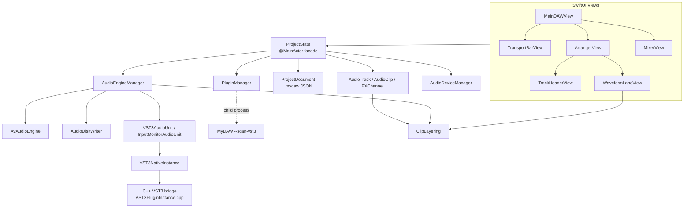

# MyDAW Project Analysis (v1.6)

> Version covered: **1.6** (source as of 2026-09-29, v1.6 release)
> Japanese edition: [PROJECT_ANALYSIS_jp.md](PROJECT_ANALYSIS_jp.md)
> Type- and function-level details: [SOURCE_SPECIFICATION_en.md](SOURCE_SPECIFICATION_en.md)

This document explains the MyDAW system as a whole: structure, signal paths, threading, persistence, design decisions and known limitations. It is meant for a developer reading the source for the first time, so they can find where things live and why they are built the way they are.

---

## 1. Overview

MyDAW is a multitrack audio recording, editing and mixing DAW for Apple Silicon Macs. The UI is SwiftUI and audio processing is AVAudioEngine; only VST3 hosting is written in C++ (Steinberg VST3 SDK).

| Item | Details |
| --- | --- |
| Platform | macOS 13 or later / Apple Silicon |
| Languages | Swift (UI, engine), C++17 / Objective-C++ (VST3 bridge) |
| Audio stack | AVAudioEngine, Core Audio HAL, AUAudioUnit (v3 subclasses) |
| Recording format | 24-bit Linear PCM WAV, 44.1 / 48 / 88.2 / 96 kHz, mono / stereo |
| Plug-ins | Audio Unit effects, VST3 effects (VST3s that also exist as an AU are hidden) |
| Code size | ~13,000 lines of Swift / ~900 lines of C++ (`Sources/` and `VST3Host/`) |
| Build | `./scripts/build.sh` (builds the VST3 bridge with CMake and links it with `swiftc`) |

### 1.1 Main features

- **Recording**: per-track input channel assignment (mono/stereo), 24-bit WAV written directly to disk, sample-accurate placement.
- **Punch in/out**: records only inside the punch range on the ruler. The whole pass is kept on disk and the take is trimmed to the range on stop (leaving handles).
- **Input monitoring**: the track's `I` button routes live input through the track's inserts, fader and sends (the recording stays dry).
- **Clip editing**: move (also across tracks), left/right trim, gain, fades with continuously adjustable curves, split, duplicate, delete, mute, normalize, reverse, undo/redo, beat snap. Tooltips show fade length, gain and curve while dragging.
- **Selection and editing**: multiple selection (shift/cmd-click, marquee, cmd+A), group moves, range selection (cmd-drag) with delete / crop / split, cut / copy / paste, option-drag to duplicate.
- **Display**: waveforms are drawn at the level heard, including fades, crossfades and parts hidden by upper clips. Wheel / pinch zoom.
- **Overlap layering**: when clips overlap, the most recently added clip wins; boundaries get crossfades (equal power by default, shaped by the upper clip's fade curve).
- **Mixer**: Studio One-style three-section strips (INSERT / SEND / controls), dB faders (up to +6 dB), stereo peak meters, pan, M/S, direct numeric entry.
- **Effects**: AU/VST3 on tracks, FX channels and master. Sends are post-insert and post-pan. Plug-in latency compensation.
- **Languages**: the GUI is available in English and Japanese (default: the macOS language), switched in Settings and applied after a restart.
- **Devices**: separate input and output devices. While running, MyDAW switches the macOS default input/output and restores them on quit. Device or sample-rate changes offer to save and restart.
- **Other**: BPM / bars-and-beats ruler, metronome, master export (24-bit WAV), project save/load, WAV import (with sample-rate / bit-depth conversion), track colours.

---

## 2. Directory and module layout

```
MyDAW/
├── Sources/                    Swift sources (the app)
│   ├── MyDAWApp.swift          @main, menus, termination, VST3 scan child mode
│   ├── Models/                 Domain model, state, persistence
│   │   ├── ProjectState.swift      Facade between UI and engine
│   │   ├── AppLanguage.swift       GUI language choice (AppleLanguages)
│   │   ├── ProjectState+Editing.swift  Selection, range selection, clipboard, group moves, clip commands
│   │   ├── AudioTrack.swift        Track (+ MixerGain, ChannelMode)
│   │   ├── AudioClip.swift         Clip (timeline placement and file range)
│   │   ├── ClipLayering.swift      Overlap / crossfade maths (pure functions)
│   │   ├── FXChannel.swift         FX channel and FXSend
│   │   ├── ProjectDocument.swift   .mydaw JSON DTOs
│   │   ├── StereoPeak.swift        L/R peak value
│   │   └── WaveformCache.swift     Waveform peak cache
│   ├── Audio/                  Audio engine, devices, plug-ins
│   │   ├── AudioEngineManager.swift  AVAudioEngine graph, playback, recording, meters
│   │   ├── AudioDiskWriter.swift     Asynchronous WAV writer
│   │   ├── ClipAudioProcessing.swift Offline processing (peak measurement, reverse, import conversion)
│   │   ├── AudioDeviceManager.swift  Core Audio HAL (devices, channels, buffer size)
│   │   ├── PluginManager.swift       AU / VST3 discovery (VST3 via child process + cache)
│   │   ├── VST3AudioUnit.swift       In-app AUv3 wrapping a VST3
│   │   ├── InputMonitorAudioUnit.swift In-app AUv3 that picks input channels
│   │   ├── VST3NativeInstance.swift  Swift wrapper around the C++ VST3 instance
│   │   ├── VST3HostBridge.swift      Swift wrapper around the VST3 enumeration API
│   │   ├── VST3Host.swift            VST3 host abstraction (protocols)
│   │   └── GenericAUParameterView.swift  Generic AU parameter UI
│   └── Views/                  SwiftUI screens
│       ├── MainDAWView.swift         Root view, startup log, export dialog, key handling
│       ├── ProjectSelectionView.swift Project chooser at launch
│       ├── TransportBarView.swift    Transport, view scaling, audio settings
│       ├── ArrangerView.swift        Timeline, ruler, punch range
│       ├── TrackHeaderView.swift     Track header, colour palette
│       ├── WaveformLaneView.swift    Waveform lane, clip gestures, overlap shading
│       ├── WaveformCanvas.swift      Waveform drawing (SwiftUI Canvas)
│       ├── MixerView.swift           Mixer (three-section strips)
│       ├── MixerControls.swift       Fader, pan, meter, dB scale
│       └── WindowCloseHandler.swift  Save prompt when the window closes
├── VST3Host/                   C++ VST3 host bridge (static library via CMake)
├── ThirdParty/vst3sdk/         Steinberg VST3 SDK
├── Resources/                  Translations (Localizable.strings and InfoPlist.strings in en.lproj / ja.lproj)
├── scripts/                    build.sh, run.sh (the supported build path), extract-strings.sh (translation check)
├── docs/                       This document, source specification, manual sources
└── snapshots/                  Manual source snapshots taken around each change
```

> **Note**: `./scripts/build.sh` and `MyDAW.xcodeproj` both produce the same app. The Xcode target runs the "Build VST3 Bridge" script phase (CMake), links the bridge and SDK static libraries through `OTHER_LDFLAGS`, then runs "Strip Extended Attributes" (`xattr -cr`) before signing. Both use arm64 only, ad-hoc signing and no hardened runtime. `Package.swift` is not kept in sync.

---

## 3. Architecture

### 3.1 Layers



- **UI → ProjectState**: views call `ProjectState` methods; `ProjectState` updates the model and pushes changes to the engine (`AudioEngineManager.syncTracks` etc.).
- **ProjectState**: owns track/FX/master configuration, undo/redo, save/load, import and export. Editing operations (selection, range selection, clipboard) live in the `ProjectState+Editing.swift` extension.
- **AudioEngineManager**: the central class (~3,800 lines) for the AVAudioEngine node graph, playback scheduling, recording, meters and plug-in creation.
- **ClipLayering**: overlap and fade-curve maths extracted as pure functions so playback and drawing (waveform amplitude) use exactly the same calculation.

### 3.2 Audio signal paths

#### Track

```
Per-clip AVAudioPlayerNode (one node per clip)
 + InputMonitorAudioUnit (only when R and I are on)
      │
      ▼
Track output mixer (fader volume)
      │
      ▼
Inserts (AU / VST3AudioUnit, in insert order)
      │
      ▼
Pan mixer (applies pan)
      │
      ▼
Splitter mixer (★ meter point: post-insert, post-fader, post-pan)
      ├──► mainMixer ──► MASTER
      └──► Send gain mixers ──► FX channel inputs
```

#### FX channel

```
FX input mixer (FX volume) → inserts → pan mixer → FX output mixer (★ meter) → mainMixer
```

#### Master

```
mainMixer → master volume mixer → master plug-ins (POST) → meter mixer (★ meter) → output device
```

#### Input (recording)

```
inputNode (all device input channels)
  ├──► input tap → channel extraction → AudioDiskWriter (WAV, dry)
  └──► InputMonitorAudioUnit (per track, when I is on) → track output mixer
```

#### Choosing input and output devices

With input in use, AVAudioEngine ignores a device set on its I/O unit (including an aggregate device the app creates) and runs on **an aggregate of the macOS default input and default output (`CADefaultDeviceAggregate`)**. MyDAW therefore makes the chosen input and output the macOS defaults before building the engine, and restores the previous defaults in `shutdown()`. A switch while running does not reach the engine, so device and sample-rate changes offer a restart (4.6).

### 3.3 VST3 hosting

VST3s are inserted into the AVAudioEngine graph as in-app AUv3 units.

1. **Discovery**: `PluginManager` runs `MyDAW --scan-vst3 <path>` as a child process per bundle and reads class info back as JSON. Results are cached with modification dates in `~/Library/Application Support/MyDAW/vst3-scan-cache.json`. The main process does not load VST3 binaries during discovery.
2. **Duplicate filtering**: VST3s whose name matches an installed AU are hidden (loading a vendor's AU and VST3 builds into one process makes them collide).
3. **Creation**: `VST3NativeInstance` (C++ `MyDAWVST3Create`) loads the module and initialises component and controller.
4. **Processing**: the `internalRenderBlock` of `VST3AudioUnit` (an `AUAudioUnit` subclass) calls `MyDAWVST3ProcessStereo` directly on the audio thread. It sits in the same chain as AUs, in insert order.
5. **Parameters**: an `IComponentHandler` receives the GUI's `performEdit` calls and delivers them to the processor as `inputParameterChanges` on the next block.
6. **State**: saved and restored with `getState` / `setState`; on restore the controller also gets `setComponentState`.
7. **Shutdown**: on quit, editors are detached and all instances destroyed so each module's `bundleExit` runs.

### 3.4 Threading model

| Thread | Work | Synchronisation |
| --- | --- | --- |
| Main (@MainActor) | UI, `ProjectState`, public `AudioEngineManager` API, graph changes | — |
| Audio render thread | AVAudioEngine rendering, `VST3AudioUnit` / `InputMonitorAudioUnit` render blocks | Lock-free (preallocated buffers); a `std::mutex` inside the VST3 bridge only (uncontended) |
| Input tap thread | `processInputAudioBuffer` (peaks, recording extraction) | `captureLock`, `recordingTimingLock`, `peakLock` |
| Writer queue | `AudioDiskWriter` WAV writes | Serial `DispatchQueue` |
| Meter timer (30 Hz) | Peak collection, notifications, punch state. Published properties are assigned only when the value changes (assigning every tick keeps observing views redrawing and stops tooltips from appearing) | `peakLock` |
| Child process | VST3 scan | stdout (JSON) |

### 3.5 Persistence

- A project is a **folder**: `MySong/MySong.mydaw` + `MySong/Recordings/*.wav`.
- `.mydaw` is JSON (`ProjectDocument` version 4). Audio is referenced by relative WAV paths, never embedded.
- AU state is stored as a binary plist of `fullStateForDocument`; VST3 state is the `getState` byte stream with `format: "vst3-state"`.
- New fields (e.g. `isInputMonitoring`, a clip's `fadeInCurve` / `fadeOutCurve`) are decoded with `decodeIfPresent`, so older files still load.
- UI preferences such as mixer section heights live in `UserDefaults` (app-wide).

---

## 4. Key flows

### 4.1 Starting playback

1. `startPlayOrRecord` waits until the plug-in graph is ready (`isPluginGraphReady`).
2. A shared start time (now + 50 ms, as host time) is chosen.
3. For each track, `scheduleClips`:
   - splits every clip with `ClipLayering.segments` into plain / hidden / shaped pieces;
   - plain pieces are streamed with `scheduleSegment`, shaped pieces are rendered with gain, fades and crossfades and scheduled with `scheduleBuffer`, hidden pieces are not scheduled;
   - times are explicit sample times so adjacent pieces join seamlessly;
   - everything is scheduled early by the track's plug-in latency.
4. Only clip nodes that received audio are started with `play(at:)`, which keeps transport start fast.
5. The metronome and playhead timer start at the same shared time.

### 4.2 Recording

1. Record button → an `AudioDiskWriter` and a new clip per armed track.
2. For every input tap buffer (~100 ms), the timeline position of each sample is derived from the buffer's host time; audio captured before the transport started is trimmed sample-accurately before writing.
3. While recording, the armed track's existing clips are muted (only inside the range when punching).
4. Stop → writers are finalised and clip metadata loaded. Punch takes are trimmed to the range and get 10 ms fades.
5. Clip position = start position − recording compensation (I/O latency + buffer + manual offset + master plug-in latency).

### 4.3 Clip overlaps (ClipLayering)

- Later entries in a track's clip array are higher layers.
- Where an upper clip plays, lower clips are silent. Across the upper clip's fade-in/out, the lower clip gets the complementary curve, i.e. a crossfade.
- A fade's shape is a `FadeCurve`: `.auto` (equal-power sin where it crosses lower-clip audio, linear against silence), `.equalPower`, or `.bend(midpoint:)` (a power curve r^p through level m at the midpoint, p = log m / log 0.5).
- A lower clip passes through the upper fade's curve mirrored in time, `curve(1 − r)` (cos for equal power, 1 − r for linear).
- Fade handles of a lower clip are hidden at edges covered by an upper clip.
- Everything is derived from positions each time, so moving or deleting the upper clip restores the lower one.
- Waveforms are drawn with amplitude from `ClipLayering.envelope`, so fades, crossfades and fully hidden parts (flat line, darkened) match what is heard.

### 4.4 Selection and editing (`ProjectState+Editing`)

- **Selection**: each track's `selectedClipIDs` (a set); `selectedClipId` remains as a computed property for compatibility. The range selection `timeSelection` (start, end, tracks) and clip selection are mutually exclusive.
- **Marquee**: dragging over empty space draws `marqueeRect` and selects every clip it touches (shift adds to the existing selection).
- **Range edits**: built on `AudioClip.piece(from:to:)` (a new clip for part of a clip, keeping fades only on shared edges); `AudioTrack.removeAudio` / `cropAudio` / `splitAudio` rebuild the clip list in layer order.
- **Clipboard**: `ClipboardClip` (file, range, gain, fades, and time/track offsets from the copied block). Paste creates new clips relative to the playhead and the selected track.
- **Group moves**: selected clips' start times are recorded when a drag begins and all move by the same delta (never before zero). A move across tracks happens only if every clip has a destination track. Option-drag inserts copies at the original positions when the drag starts (directly below each original in layer order).
- **Clip commands**: Normalize measures the whole file's peak and sets the clip gain (non-destructive). Reverse writes the clip's range backwards to a new WAV and switches the clip to it (the original file stays, so Undo restores it).
- **Undo**: each operation is one step via `beginClipEdit()` / `endClipEdit()`; nothing is recorded if the clips did not change.

### 4.5 WAV import

`importAudioFile` copies the file into `Recordings/` as is when it is already 24-bit integer PCM at the current sample rate; otherwise `ClipAudioProcessing.writeConverted` (AVAudioConverter, maximum sample-rate converter quality) writes a 24-bit WAV at the current rate.

### 4.6 Device changes and restart

1. Changing the input/output device, sample rate or language and clicking Apply → devices and sample rate go through `applyAudioDevices` (sets the device sample rate and switches the macOS default input/output); the language through `AppLanguage.select`.
2. On success `ProjectState.promptRestartForAudioSettings` asks Save and Restart / Restart Without Saving / Cancel.
3. The restart runs `/bin/sh`, which waits for the current process to exit and then runs `open -n MyDAW.app --args <project.mydaw>`; the app then quits. The new process opens the project passed on the command line.

### 4.7 Input monitoring and send wiring

- The input (inputNode) → `InputMonitorAudioUnit` → track output connection can only be rewired safely with the engine stopped, so switching I during playback is deferred until stop.
- On stop the deferred rewiring (input monitors, fan-out for sends added while playing) does not happen at once: `applyDeferredRewiresWhenQuiet` waits until the master output is below -60 dB (at most 8 s), so pausing the engine does not cut FX tails. A `syncTracks` during the wait leaves the rewiring to it.
- The stop-time recording finalisation calls `syncTracks` only when files were actually recorded (otherwise a plain stop would rewire at once).
- Send gain mixers are not rewired on every sync: `wireSend` connects one only when its FX input changes (`wiredSendTargets`).

### 4.8 Localisation

- GUI strings use the English text as the key; `Resources/{en,ja}.lproj/Localizable.strings` supply the displayed text. SwiftUI string literals (`Text("…")`, `.help("…")`, …) are localised as they are; strings in variables, NSAlerts, panels and logs are wrapped in `String(localized:)`.
- The language comes from the app's own `AppleLanguages` default (`AppLanguage`); unset, it follows the macOS preferred languages, falling back to English. It is read only at launch, so a change applies after a restart.
- `scripts/extract-strings.sh` uses the compiler's `-emit-localized-strings` to extract the localisable strings and reports keys missing from or unused in `ja.lproj`. The English/Japanese table is `docs/UI_Strings_en_ja.csv`.
- Symbol-like labels stay in English: the mixer's MASTER and STEREO OUT, the meter's REC IN / OUT, and M/S/R/I/P.

### 4.9 Mixer changes

- Fader, pan and send changes go through `updateMixerLevels` / `setSend` straight to the mixer nodes.
- After a volume change the mixer is `reset()` so its volume ramp completes immediately (a stopped input does not advance the ramp and would otherwise leak the old level on its next note).
- Solo and mute are implemented through the track output mixer volume.

---

## 5. Design decisions and lessons learned

AVAudioEngine and plug-in pitfalls found while building v1.4–1.6, and how they were solved. Keep these in mind when changing the engine.

| Symptom | Cause | Fix |
| --- | --- | --- |
| VST3 track ~400 ms late when starting mid-song | Buffers scheduled with `at: nil` that arrive after the start time stay late; lock contention with many `play(at:)` calls on the main thread | Schedule every chunk with explicit times; later VST3 moved to real-time in-app AUv3 processing |
| Rare crash at launch (-10865) | Reconnecting an AU whose render resources are allocated with a different format | `connectReformatting` deallocates render resources first |
| Crashes when AU and VST3 of the same vendor coexist | Shared ObjC classes / support libraries between the two builds | VST3 scanning in a child process; VST3s with an AU twin are hidden |
| VST3 GUI changes not heard | No `IComponentHandler`, so no `inputParameterChanges` | Implement the handler and pass changes every block |
| Input stops when input monitoring is on | A one-to-many connect made while running ignores the format and leaves a 44.1 kHz mixer; the input then refuses 513-frame cycles | Rewire fan-out only with the engine stopped (deferred to stop while playing) |
| Muted/soloed-out track leaks for an instant | A mixer volume ramp does not advance on silent inputs | `reset()` the mixer after volume changes |
| Recordings land ~100 ms late | The pre-start part of the first tap buffer was written as-is | Trim sample-accurately using the buffer's host time |
| Pan ignored by meters and on tracks with inserts | AVAudioMixing pan only applies on connections into a mixer | Dedicated pan mixer after the inserts |
| Guitar Rig 7 crashes on quit | `exit()` ran without the VST3 module's `bundleExit` | Destroy VST3 instances on shutdown |
| Chosen input/output devices ignored; audio plays and records on the defaults | With input in use, AVAudioEngine rejects a device or app-made aggregate set on its I/O unit and substitutes an aggregate of the default devices (`CADefaultDeviceAggregate`); setting one later leaves a stale 0-channel input format and installing the tap throws | Switch the macOS default input/output to the chosen devices before building the engine and restore them on quit; changes apply after a restart |
| Transport bar tooltips never appear | The meter timer assigned `masterPeak` / `masterStereoPeak` at 30 Hz even when stopped, so views observing `AudioEngineManager` redrew constantly | Assign only on change; decayed meter values below -100 dB become 0 |
| No tooltips right after opening a project (they appear after resizing the window) | When a full-window overlay (start screen, the plug-in scan log left in place but transparent) goes away the layout below is unchanged, so SwiftUI does not re-register tooltip areas | Remove the scan log from the view hierarchy when hidden; when an overlay goes away, widen the window by 1 pt and back (`refreshToolTips`) |
| Toggling input monitoring (I) freezes the UI or crashes | With input monitoring on, `syncTracks` disconnected and reconnected every send into the FX inputs on each sync and AVAudioEngine threw `required condition is false: mixingDest`. AppKit swallows ObjC exceptions raised inside button actions, leaving Swift state broken so a later button action crashed | Wire a send only when its target changes (`wireSend`). Reproduced outside a button action with a temporary env-var test hook to read the exception |
| Turning I on while playing, then stopping, cuts the FX reverb tail with a replayed-block sound | The stop-time rewiring of the deferred input monitor paused the engine; the recording finalisation also called `syncTracks` even without a recording, rewiring at once | Rewire only once the master output is below -60 dB; sync after finalisation only after a recording. Verified by capturing the master output around the stop and comparing the decay |

---

## 6. Known limitations

- **Build**: `Package.swift` is out of date; use `./scripts/build.sh` or `MyDAW.xcodeproj`.
- **Device and sample-rate changes**: the engine and VST3 instances are built for the device and rate at launch, so changes apply after a restart (MyDAW offers one when you change them).
- **macOS default devices**: while MyDAW runs, the chosen devices are the macOS default input/output and affect other apps too. They are not restored after a crash.
- **Shaped pieces of mismatched-rate audio**: imports are converted, but audio at a rate different from the device (for example clips recorded before a sample-rate change) has shaped and plain pieces converted separately, which can leave a tiny step at the join.
- **Heavy work on the main thread**: import conversion and Reverse run synchronously on the main thread, so long files briefly pause the UI.
- **Input monitoring switched while playing**: takes effect after stopping — when turned on, the input is heard once tails have faded (at most 8 s); when turned off, the input stays audible until stop.
- **Tooltip re-registration**: re-registering tooltips when an overlay goes away relies on a workaround (briefly changing the window width).
- **Plug-in GUIs**: a plug-in without its own editor, or whose editor request does not answer within 3 s, is shown with the Generic UI (`presentGenericPluginView`). There are no per-product exceptions (every `PluginCompatibilityProfile` is currently `.automatic`).
- **Instruments**: not supported in AU or VST3 (effects only). AU discovery looks only for `kAudioUnitType_Effect`, so music effects (`aumf`) are not listed either.
- **Input monitoring latency**: depends on buffer size (about 25–30 ms round trip at 48 kHz / 512 frames). Use 128–256 for guitar. Using the interface's direct monitoring at the same time makes the signal sound doubled.
- **Graph changes while playing**: inserting, removing and reordering plug-ins is only allowed while stopped.

---

## 7. Improvement candidates

### High priority
1. Update or remove `Package.swift` (the Xcode project was updated in v1.6).
2. Device, sample-rate and language changes without a restart (rebuilding the engine and VST3 instances, switching the GUI language live).
3. Automated tests, starting with pure logic (`ClipLayering`, `FadeCurve`, range edits, dB conversion, recording trim).
4. Run import conversion and Reverse in the background with progress.

### Medium priority
1. Split `AudioEngineManager` (~3,800 lines) into graph building, playback scheduling, recording and metering types.
2. More robust saving (atomic writes, autosave, tracking unsaved changes).
3. Track reordering; integration with the system clipboard.
4. Unify conversion of shaped pieces to remove joins in mismatched-rate audio.
5. Move the meters into their own views so transport bar tooltips also appear during playback.

### Low priority
1. MIDI and instruments.
2. Automation.
3. Out-of-process plug-in hosting (resilience against collisions and crashes).

---

## 8. Development and verification practice

- Sources are snapshotted to `snapshots/<name>-<timestamp>/` before and after changes (Git is not used).
- Build with `./scripts/build.sh`. When building inside Google Drive, the script strips extended attributes before code signing.
- Runtime logging: stdout is buffered and its tail is lost on a crash. Use stderr (`FileHandle.standardError`) or a file for diagnostics; `NSLog` output may not be readable from the system log.
- For audio timing problems, do not fix by guesswork: measure with shared-clock timestamps or dump the graph first, then fix.
