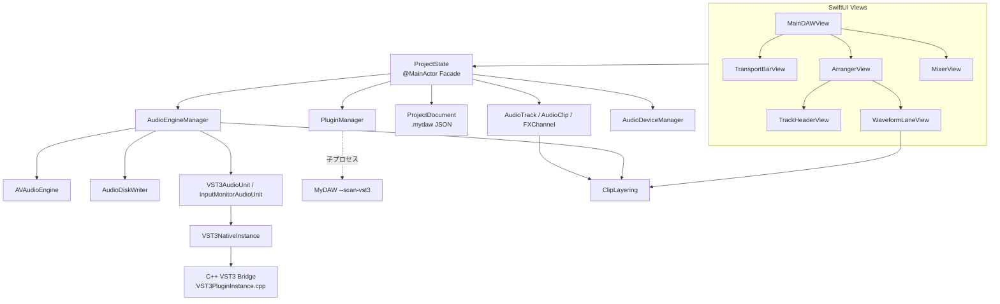

# MyDAW プロジェクト解析（v2.1）

> 対象バージョン: **2.1**（2026-10-04 時点のソース）
> 英語版: [PROJECT_ANALYSIS_en.md](PROJECT_ANALYSIS_en.md)
> 型・関数単位の詳細: [SOURCE_SPECIFICATION_jp.md](SOURCE_SPECIFICATION_jp.md)

本書は MyDAW のシステム全体を、構成・信号経路・スレッド設計・データ保存・設計判断・既知の制約の観点から説明します。ソースを初めて読む開発者が、どこに何があり、なぜそうなっているかを把握できることを目的とします。

---

## 1. 概要

MyDAW は Apple Silicon Mac 向けのマルチトラック・オーディオ録音／編集／ミキシング DAW です。SwiftUI（UI）と AVAudioEngine（音声処理）で構成され、VST3 ホスティングのみ C++（Steinberg VST3 SDK）で実装しています。

| 項目 | 内容 |
| --- | --- |
| 対象 | macOS 13 以上 / Apple Silicon |
| 言語 | Swift（UI・エンジン）、C++17 / Objective-C++（VST3 ブリッジ） |
| 音声基盤 | AVAudioEngine、Core Audio HAL、AUAudioUnit（v3 サブクラス） |
| 録音形式 | 24-bit Linear PCM WAV、44.1 / 48 / 88.2 / 96 kHz、モノラル／ステレオ |
| プラグイン | Audio Unit エフェクト、VST3 エフェクト（同名の AU がある VST3 は一覧から除外） |
| ソース規模 | Swift 約 18,600 行 / C++ 約 900 行（`Sources/` と `VST3Host/`） |
| ビルド | `./scripts/build.sh`（CMake で VST3 ブリッジを構築し `swiftc` でリンク） |

### 1.1 主な機能

- **録音**: トラックごとに入力チャンネル（モノ／ステレオ）を割当て、24-bit WAV へディスク直書き。録音位置はサンプル単位で補正。録音済みのトラックもモノ／ステレオを切り替え可能で、ファイルは書き換えない（モノのトラックではステレオのクリップを (L+R)/2 で再生）。
- **パンチイン／アウト**: ルーラー上のパンチ範囲だけを録音。録音は通し全体を保存し、停止時にパンチ範囲へトリミング（前後の余白を保持）。録音中はパンチ範囲内の部分だけを表示。
- **インプットモニタリング**: トラックの `I` ボタンで、入力をトラックのインサート・フェーダー・Send を通して試聴（録音は原音）。
- **クリップ編集**: 移動（トラック間含む）、左右トリム、ゲイン、フェード（カーブを連続的に調整）、分割、複製、削除、ミュート、ノーマライズ、逆再生、無音部分をトリム、UNDO／REDO、拍スナップ。ドラッグ中はフェード長・ゲイン・カーブをツールチップ表示。
- **選択と編集**: 複数選択（shift／cmd クリック、枠選択、cmd+A）、まとめて移動、範囲選択（cmd ドラッグ）による削除・切り出し・分割、カット／コピー／ペースト、option ドラッグで複製。右クリックメニューは選択中のクリップすべてに働く（選択外のクリップを右クリックするとそれを選択）。
- **トラックの並べ替え**: トラックヘッダのドラッグで並べ替え。ドラッグ中はヘッダと波形レーンが一緒にポインタに追従し、落とし先を白い線で示す。ミキサーのストリップも同じ順。
- **トラックフォルダ**（v2.1）: 1 階層のフォルダでトラックをまとめる。フォルダ内のトラックはインデント表示。開閉（閉じたフォルダのトラックは描画しない）、フォルダごとの移動、色、名前、M／S（中のトラックをトラック自身の M／S との OR で強制し、オフで元に戻る）。トラックヘッダの右クリックメニュー（トラック／フォルダの追加、ミキサーに表示）。
- **表示**: 波形はフェード・クロスフェード・上位クリップによる隠れを反映した音量で描画。ホイール／ピンチで拡大縮小。再生中の自動スクロールは ON／OFF 可能。
- **重なり処理（レイヤー）**: クリップが重なると後から追加したクリップが優先。境界はクロスフェード（既定は等パワー、形は上位クリップのフェードカーブ）。
- **ミキサー**: Studio One 風の 3 区画ストリップ（INSERT／SEND／コントロール）、dB フェーダー（最大 +6 dB）、ステレオ・ピークメーター、PAN、M／S（FX チャンネルにも。FX のソロはそのリターンだけを再生）、数値直接入力。フォルダと FX チャンネルの始まりに色の縦線（クリックで色変更。FX は全チャンネル共通の色）、カレントトラックの名前欄の反転表示、たたむボタン（v2.1）。
- **エフェクト**: トラック・FX チャンネル・マスターへ AU／VST3 を挿入。ポストインサート・ポストパンの Send。トラックのインサートと FX チャンネルのプラグイン遅延補正。トランスポートの先読みで、再生位置以降の音は欠けない（3.2、4.1）。
- **デバイス**: 入力と出力に別々のデバイスを選択可能。起動中は macOS の既定入出力を切り替え、終了時に復元。デバイス・サンプルレート変更時は保存と再起動を確認。
- **表示言語**: GUI は日本語・英語に対応（初期値は macOS の言語）。設定画面で切り替え、再起動後に反映。
- **曲の開始・終了フラグ**: ルーラー上に任意で設定。先頭へ戻るで開始フラグへ（もう一度で 0 へ）、終了フラグで再生・録音を停止、書き出し範囲の初期値にも使用。
- **その他**: BPM・小節表示ルーラー（拍ごとに跳ねる再生位置の ●）、メトロノーム（再生・録音中も ON／OFF 可）、マスター書き出し（24-bit WAV、サンプル単位で正確な範囲）、プロジェクト保存／読込、WAV 取り込み（サンプルレート・ビット数を変換）、未使用の録音ファイルを `Recordings/Unused` へ移動、トラック色変更、ヘルプメニューから操作マニュアル（Web の PDF）を表示。

---

## 2. ディレクトリとモジュール構成

```
MyDAW/
├── Sources/                    Swift ソース（アプリ本体）
│   ├── MyDAWApp.swift          @main、メニュー、終了処理、VST3 スキャン子プロセス分岐
│   ├── Models/                 ドメインモデル・状態・永続化
│   │   ├── ProjectState.swift      UI とエンジンの仲介（Facade）
│   │   ├── RecentProjects.swift    最近使ったプロジェクトの履歴（UserDefaults）
│   │   ├── AppLanguage.swift       GUI 言語の選択（AppleLanguages）
│   │   ├── ProjectState+Editing.swift  選択、範囲選択、クリップボード、まとめて移動、クリップ処理コマンド
│   │   ├── ProjectState+Folders.swift  トラックとフォルダの並び（rows）、フォルダの追加・削除・開閉・M／S、並べ替え
│   │   ├── TrackFolder.swift       トラックフォルダ、行（ArrangerRow）、ヘッダ列の幅（ArrangerLayout）
│   │   ├── AudioTrack.swift        トラック（+ MixerGain, ChannelMode）
│   │   ├── AudioClip.swift         クリップ（タイムライン配置とファイル範囲）
│   │   ├── ClipLayering.swift      クリップ重なり・クロスフェード計算（純粋関数）
│   │   ├── FXChannel.swift         FX チャンネルと FXSend
│   │   ├── ProjectDocument.swift   .mydaw JSON の DTO 群
│   │   ├── StereoPeak.swift        L/R ピーク値
│   │   └── WaveformCache.swift     波形ピークキャッシュ
│   ├── Audio/                  音声エンジン・デバイス・プラグイン
│   │   ├── AudioEngineManager.swift  AVAudioEngine グラフ、再生、録音、メーター
│   │   ├── AudioDiskWriter.swift     WAV 非同期書き込み
│   │   ├── ClipAudioProcessing.swift オフライン処理（ピーク測定、無音区間の検出、逆再生、取り込み時の変換）
│   │   ├── AudioDeviceManager.swift  Core Audio HAL（デバイス・チャンネル・バッファ）
│   │   ├── AudioLoadMonitor.swift    オーディオ処理負荷の計測と音飛びの検出
│   │   ├── PluginManager.swift       AU／VST3 検出（VST3 は子プロセス＋キャッシュ）
│   │   ├── VST3AudioUnit.swift       VST3 を包むアプリ内 AUv3
│   │   ├── InputMonitorAudioUnit.swift 入力チャンネル抽出用アプリ内 AUv3
│   │   ├── MonoDownmixAudioUnit.swift モノラルのトラックを L/R 加算するアプリ内 AUv3
│   │   ├── TrackRenderer.swift トラックの再生（AVAudioSourceNode ＋ 先読みスレッド）
│   │   ├── DelayCompensationAudioUnit.swift FX の遅延補正用の遅延アプリ内 AUv3
│   │   ├── VST3NativeInstance.swift  C++ VST3 インスタンスの Swift ラッパー
│   │   ├── VST3HostBridge.swift      VST3 列挙 API の Swift ラッパー
│   │   ├── VST3Host.swift            VST3 ホスト抽象（プロトコル）
│   │   └── GenericAUParameterView.swift  AU の汎用パラメータ UI
│   └── Views/                  SwiftUI 画面
│       ├── MainDAWView.swift         画面ルート、起動ログ、書き出しダイアログ、キー処理
│       ├── ProjectSelectionView.swift 起動時のプロジェクト選択
│       ├── AudioLoadIndicator.swift  ステータスバーの CPU 表示と音飛びマーク
│       ├── TransportBarView.swift    トランスポート、表示倍率、オーディオ設定
│       ├── ArrangerView.swift        タイムライン、ルーラー、パンチ範囲
│       ├── TrackHeaderView.swift     トラックヘッダー、色パレット、M／S ボタンの表示
│       ├── FolderHeaderView.swift    フォルダのヘッダー（開閉、色、名前、M／S、削除）
│       ├── WaveformLaneView.swift    波形レーン、クリップ操作、重なり表示
│       ├── WaveformCanvas.swift      波形描画（SwiftUI Canvas）
│       ├── MixerView.swift           ミキサー（3 区画ストリップ）
│       ├── MixerControls.swift       フェーダー、PAN、メーター、dB スケール
│       └── WindowCloseHandler.swift  ウィンドウを閉じたらアプリを終了（保存確認は終了処理側）、タイトルバーのダブルクリックでズーム
├── VST3Host/                   C++ VST3 ホストブリッジ（CMake で静的ライブラリ化）
├── ThirdParty/vst3sdk/         Steinberg VST3 SDK
├── Resources/                  翻訳（en.lproj・ja.lproj の Localizable.strings、InfoPlist.strings）
├── scripts/                    build.sh・run.sh（正式なビルド手順）、extract-strings.sh（翻訳漏れの確認）
├── docs/                       本書、ソース仕様書、マニュアル原稿
└── snapshots/                  作業ごとのソーススナップショット（手動バックアップ）
```

> **注意**: `./scripts/build.sh` でも `MyDAW.xcodeproj` でも同じアプリができます。Xcode ターゲットは「Build VST3 Bridge」スクリプトフェーズ（CMake）を実行し、`OTHER_LDFLAGS` でブリッジと SDK の静的ライブラリをリンクし、署名の前に「Strip Extended Attributes」（`xattr -cr`）を実行します。どちらも arm64 のみ、アドホック署名、Hardened Runtime なしです。`Package.swift` は現行ソースに追従していません。

---

## 3. アーキテクチャ

### 3.1 レイヤー構成



- **UI → ProjectState**: 画面操作は原則 `ProjectState` のメソッドを呼び、`ProjectState` がモデルを更新して `AudioEngineManager.syncTracks` などでエンジンへ反映します。
- **ProjectState**: トラック・FX・マスター構成、UNDO／REDO、保存／読込、取り込み、書き出しの窓口です。選択・範囲選択・クリップボードなどの編集操作は拡張 `ProjectState+Editing.swift` にあります。
- **AudioEngineManager**: AVAudioEngine のノード構成（グラフ）と再生スケジュール、録音、メーター、プラグイン生成を担う中心クラスです（約 4,500 行）。
- **ClipLayering**: クリップ重なりとフェードカーブの計算を純粋関数として切り出したもので、再生と画面表示（波形の振幅）が同じ計算を共有します。

### 3.2 オーディオ信号経路

#### トラック

```
TrackRenderer（AVAudioSourceNode、トラックに 1 つ。先読みしたクリップの音）
 ＋ InputMonitorAudioUnit（R と I が ON のときのみ）
      │
      ▼
トラック出力ミキサー（フェーダー音量）
      │
      ▼
MonoDownmixAudioUnit（モノラルのトラックは (L+R)/2、ステレオはそのまま）
      │
      ▼
インサート（AU / VST3AudioUnit を挿入順に直列）
      │
      ▼
PAN ミキサー（PAN を適用）
      │
      ▼
分岐ミキサー（★メーター計測点：ポストインサート・ポストフェーダー・ポストパン）
      ├──► DelayCompensationAudioUnit（ドライ：D だけ遅延。FX ソロ時のドライ消音もここ）──► mainMixer ──► MASTER
      └──► Send ゲインミキサー ──► 各 FX チャンネル入力
```

プラグインの遅延補正：クリップは「トラックのインサートの遅延 ＋ D」だけ早めて予約します。D は FX チャンネルの遅延の最大値です。ドライ経路を D、各 FX のリターンを「D − その FX の遅延」だけ遅らせるので、ドライ・ウェット・メトロノームがタイムラインにそろいます。バイパス中のプラグインも遅延を数え（バイパス中も遅延は保たれる。VST3 ラッパーはバイパス時の素通り音を遅らせる）、センドを受けていない FX も含めます。プラグインが kAudioUnitProperty_Latency の変更を通知したら、遅延を読み直します。

#### FX チャンネル

```
FX 入力ミキサー（FX 音量）→ インサート → PAN ミキサー → DelayCompensationAudioUnit（リターン：D − 自分の遅延）→ FX 出力ミキサー（★メーター。ミュート・ソロ）→ mainMixer
```

#### マスター

```
mainMixer → マスターボリュームミキサー → マスタープラグイン（POST）→ メーター用ミキサー（★メーター）→ 出力デバイス
```

#### 入力（録音）

```
inputNode（デバイスの全入力チャンネル）
  ├──► 入力タップ → チャンネル抽出 → AudioDiskWriter（WAV、原音）
  └──► InputMonitorAudioUnit（トラックごと、I ボタン ON 時）→ トラック出力ミキサー
```

#### 入出力デバイスの選択

入力を使う AVAudioEngine は、I/O ユニットに設定したデバイス（アプリで作った集約デバイスを含む）を無視し、**macOS の既定入力＋既定出力から作る集約デバイス（`CADefaultDeviceAggregate`）**で動作します。そのため MyDAW は、選んだ入力・出力を macOS の既定入出力に設定してからエンジンを構築し、終了時（`shutdown()`）に起動前の既定へ戻します。実行中の切り替えはエンジンに反映されないため、デバイスやサンプルレートを変えたときは再起動を確認します（4.6）。

### 3.3 VST3 ホスティング

VST3 は「アプリ内 AUv3」として AVAudioEngine のグラフへ組み込みます。

1. **検出**: `PluginManager` がバンドルごとに `MyDAW --scan-vst3 <path>` を子プロセスで起動し、JSON でクラス情報を受け取ります。結果は `~/Library/Application Support/MyDAW/vst3-scan-cache.json` に更新日時付きでキャッシュします。本体プロセスには検出時点で VST3 バイナリを読み込みません。
2. **重複除外**: 同名の AU が存在する VST3 は一覧から除外します（同一メーカーの AU／VST3 を同一プロセスへ同時に読み込むと衝突するため）。
3. **生成**: `VST3NativeInstance`（C++ `MyDAWVST3Create`）がモジュールを読み込み、コンポーネント・コントローラを初期化します。
4. **処理**: `VST3AudioUnit`（`AUAudioUnit` サブクラス）の `internalRenderBlock` がオーディオスレッド上で `MyDAWVST3ProcessStereo` を直接呼びます。AU と同じチェーンに挿入順で並びます。
5. **パラメータ**: `IComponentHandler` 実装が GUI の `performEdit` を受け、次ブロックで `inputParameterChanges` としてプロセッサへ渡します。
6. **状態**: `getState`／`setState` で保存・復元し、復元時はコントローラにも `setComponentState` を渡します。
7. **終了**: アプリ終了時にエディタを外し、全インスタンスを破棄してモジュールの `bundleExit` を実行させます。

### 3.4 スレッドモデル

| スレッド | 主な処理 | 同期手段 |
| --- | --- | --- |
| メイン（@MainActor） | UI、`ProjectState`、`AudioEngineManager` の公開 API、グラフ変更 | — |
| オーディオ描画スレッド | AVAudioEngine の描画、`VST3AudioUnit`／`InputMonitorAudioUnit` の render block | ロックなし（事前確保バッファ）、VST3 側のみ `std::mutex`（競合なし） |
| 入力タップスレッド | `processInputAudioBuffer`（ピーク計算、録音データ切り出し） | `captureLock`、`recordingTimingLock`、`peakLock` |
| 書き込みキュー | `AudioDiskWriter` の WAV 書き込み | シリアル `DispatchQueue` |
| 負荷モニター Timer（10 Hz） | `AudioLoadMonitor`: 出力ユニットの render notify（描画スレッド上で処理時間を計測）の集計、音飛びの判定、CPU 表示の更新 | 描画スレッドは整列した 64 bit 値を書くだけ（ロックなし）。メイン側が累計の差分を取る |
| メーター Timer（30 Hz） | ピーク集計、通知、パンチ状態更新。公開プロパティは値が変わったときだけ代入（毎回代入すると監視ビューが常時再描画され、ツールチップが出なくなる） | `peakLock` |
| 子プロセス | VST3 スキャン | 標準出力（JSON） |

### 3.5 データ保存

- プロジェクトは **`.mydaw` ファイル単位**。録音は `.mydaw` と同じ場所の `Recordings/*.wav`（例 `MySong/Ballad.mydaw` + `MySong/Recordings/`）。プロジェクトフォルダー＝`.mydaw` の親フォルダーで、名前の一致は不要（v2.0 から。v1.9 以前の「フォルダー名＝ファイル名」のプロジェクトもそのまま開ける）。
- 同じフォルダーに複数の `.mydaw` を置くと `Recordings/` を共有する。録音ファイル名は空き番号で採番するので上書きはなく、未使用ファイルの移動は同じフォルダーの全 `.mydaw` のクリップを使用中として扱う。「名前を変えて保存」は同じフォルダーにのみ保存する（録音ファイルをコピーせずに済み、相対パスもそのまま使えるため）。
- `.mydaw` は JSON（`ProjectDocument` バージョン 5）。音声は WAV への相対パスで参照し、埋め込みません。
- フォルダ（v2.1、バージョン 5）は `folders`（名前・色・開閉・M／S と、トラックとフォルダを合わせた行の中の位置 `position`）と、トラックごとの `folderID` で保存します。読み込みでは、トラックの列に位置の小さい順にフォルダを差し込んで行を復元します。バージョン 4 以前のファイルはフォルダなしとして開けます。v2.0 で v2.1 のファイルを開くと、フォルダは無視されます（トラックは残る）。
- AU の状態は `fullStateForDocument` を binary plist 化、VST3 の状態は `getState` のバイト列を `format: "vst3-state"` で保存します。
- 新しい項目（`isInputMonitoring`、クリップの `fadeInCurve`／`fadeOutCurve` など）は `decodeIfPresent` で後方互換を保ちます。
- ミキサーの区画の高さ、ミキサーをたたんだ状態（`mixer.collapsed`）、スナップ（`MyDAW.snapToGrid`）、自動スクロール（`MyDAW.autoScroll`）など画面設定は `UserDefaults`（アプリ共通）に保存します。
- 起動画面の「最近使ったプロジェクト」（最大 50 件、`.mydaw` のパスと最終保存日時）も `UserDefaults`（キー `MyDAW.recentProjects`）に保存します。

---

## 4. 主要処理フロー

### 4.1 再生開始

1. `startPlayOrRecord` → プラグイングラフの準備完了を待つ（`isPluginGraphReady`）。
2. 各トラックのレンダラー（`TrackRenderer`）に開始位置を伝え（`prepare`）、バックグラウンドの `TrackStreamer` が開始位置からのブロックをファイルから読み、ゲイン・フェード・クロスフェードを掛けてミックスするのを待つ（24 トラックで数 ms）。区間分けは `ClipLayering.segments`（隠れる区間は読まない）。
3. 開始時刻を決める：エンジンの計算済み区間の先（`lastRenderTime` から IO バッファ 2 つ分、最低 50 ms）に P を足す（P はトランスポートの先読み、D は FX の遅延補正。3.2 参照）。
4. 開始時に準備が必要なもの（メトロノーム、録音）を先に開始する（`beforePlayersStart`）。
5. 各レンダラーを開始する。各トラックは「自分のインサートの遅延 ＋ D」だけ早く音を出す。プレイヘッドタイマー・メトロノーム・録音はトランスポート開始時刻を基準にする。クリップごとのプレイヤーや `play(at:)` を使わないので、開始時にメインスレッドやエンジンが待たされない。再生中の編集は、レンダラーが再生位置の少し先から読み直して反映する。

### 4.2 録音

1. 録音ボタン → 4.1 と同じ手順で先読みと開始時刻の決定を行い、レンダラーを開始する前に、armed トラックごとに `AudioDiskWriter` と新規クリップを作成して入力の取り込みを始める。
2. 入力タップ（約 100 ms 単位のバッファ）ごとに、バッファの hostTime から各サンプルのタイムライン位置を計算し、再生開始前の部分をサンプル単位で切り捨てて WAV に書き込む。
3. 録音中は録音対象トラックの既存クリップをミュート（パンチ時は範囲内のみ）。
4. 停止 → writer を確定し、クリップのメタデータを読み込む。パンチ録音なら範囲へトリミングし 10 ms のフェードを付与。
5. クリップ位置 = 開始位置 − 録音遅延補正（入出力遅延 + バッファ + 手動補正 + マスタープラグイン遅延）。

### 4.3 クリップの重なり（ClipLayering）

- トラック内のクリップ配列の後ろ（後から追加）ほど上のレイヤー。
- 上のクリップが鳴っている区間では下のクリップは無音。上のフェードイン／アウトの区間は下が逆のカーブで出入りするクロスフェードになる。
- フェードの形は `FadeCurve`: `.auto`（下のクリップの音と重なるときは等パワー sin、無音に対しては直線）、`.equalPower`、`.bend(midpoint:)`（中間点の音量 m を通るべき乗曲線 r^p、p = log m / log 0.5）。
- 下のクリップの透過率は、上のフェードカーブを時間反転した値 `curve(1 − r)`（等パワーなら cos、直線なら 1 − r）。
- 重なっている側の下のクリップのフェードハンドルは表示しない（操作不可）。
- すべて位置から毎回計算するため、上のクリップを移動・削除すると下は自動的に元に戻る。
- 画面の波形は `ClipLayering.envelope` の音量で振幅を描くため、フェード・クロスフェードの形と、完全に隠れた区間（平らな線＋暗い表示）が再生音と一致する。

### 4.4 選択と編集操作（`ProjectState+Editing`）

- **選択**: 各トラックの `selectedClipIDs`（集合）。`selectedClipId` は互換用の計算プロパティ。範囲選択 `timeSelection`（開始・終了・トラック列）とクリップ選択は排他。
- **枠選択**: 空き領域のドラッグで `marqueeRect` を描き、矩形に触れるクリップを選択（shift で既存選択に追加）。
- **範囲編集**: `AudioClip.piece(from:to:)`（範囲部分の新クリップ。共有する端だけフェードを引き継ぐ）を基に、`AudioTrack.removeAudio`／`cropAudio`／`splitAudio` がクリップ列をレイヤー順のまま組み替える。
- **クリップボード**: `ClipboardClip`（ファイル・範囲・ゲイン・フェード・先頭からの時間とトラックのオフセット）。ペーストは再生位置と選択トラックを基準に新規クリップを作る。
- **まとめて移動**: ドラッグ開始時に選択クリップの開始位置を記録し、同じ時間差で移動（0 秒より前には出さない）。トラック間移動は全クリップの移動先があるときのみ。option ドラッグは開始時に元の位置へ複製を挿入（元クリップの直下のレイヤー）。ドラッグ中、選択クリップは元のレーンでは隠し、`clipDragPreview`（選択全体・縦の移動量・移動先までのトラック数）を基に、各クリップを自分のトラックから縦の移動量だけずらしてかたまりで描く。別のトラックへ移す途中は `layeringClips(for:)` が移動中のクリップを移動元の重なりから外し、移動先では最上位として数える（移動元に誤った「隠れ」の黒塗りを出さず、移動先のクロスフェードを先に見せる）。
- **トラックの並べ替え**: `ProjectState.moveTrack(id:beforeRowID:folderID:)`／`moveFolder(id:beforeRowID:)` が行（`rows`）の順を入れ替えるだけ（4.10）。オーディオグラフはトラック ID で引くため、つなぎ直しは不要。範囲選択は隣接トラックが前提のため解除する。ドラッグ中の落とし先は `ArrangerView.reorderDropTarget()`（行の間のうちポインタに最も近い所。フォルダの最後のトラックの下は、ポインタがその行の上ならフォルダ内、下の行にかかればフォルダ外）。
- **見えているトラックだけが対象**: 範囲選択、トラック間のクリップ移動、ペースト（トラックのオフセット）、cmd+A、枠選択は `visibleTracks`（閉じたフォルダのトラックを除いた並び）で数える。フォルダを閉じると、その中のクリップ選択と範囲選択は解除し、UNDO も隠れたトラックの選択は戻さない。カレントトラックが隠れているときのペーストは、その下で最初に見えるトラックから貼る。
- **クリップ処理**: ノーマライズはファイル全体のピークを測りクリップゲインを設定（非破壊）。逆再生はクリップ範囲を逆順に書いた WAV を作り、クリップを差し替える（元ファイルは残るため UNDO で戻る）。無音部分をトリムは、サンプル値が無音レベル（既定 −72 dB）以下のまま指定秒数以上続く区間の前後でクリップを分割して無音のクリップを削除し、短いフェードを付ける（非破壊）。
- **右クリックメニュー**: 対象は `menuTargets`（右クリックしたクリップが選択中なら選択全体、そうでなければそのクリップ）。ミュートは 1 つでも未ミュートがあれば全ミュート、複製は対象をかたまりのまま先頭を再生位置へ、分割は再生位置にかかる対象だけ。範囲選択の内側では範囲メニュー。
- **UNDO**: すべて `beginClipEdit()`／`endClipEdit()` で 1 手順にまとめ、クリップの状態が変わらなかった場合は履歴に積まない。

### 4.5 WAV 取り込み

`importAudioFile` は、ファイルが今のサンプルレートの 24-bit 整数 PCM ならそのまま `Recordings/` へコピーし、そうでなければ `ClipAudioProcessing.writeConverted`（AVAudioConverter、最高品質のサンプルレート変換）で 24-bit WAV に変換して保存する。

### 4.6 デバイス変更と再起動

1. 設定画面で入出力デバイス・サンプルレート・言語のいずれかを変えて Apply → デバイスとサンプルレートは `applyAudioDevices`（デバイスのサンプルレート設定、macOS 既定入出力の切り替え）、言語は `AppLanguage.select`。
2. 成功したら `ProjectState.promptRestartForAudioSettings` が Save and Restart／Restart Without Saving／Cancel を確認。
3. 再起動は `/bin/sh` で現プロセスの終了を待ってから `open -n MyDAW.app --args <project.mydaw>` を実行し、アプリを終了する。新しいプロセスは起動引数のプロジェクトを開く。

### 4.7 インプットモニターと Send の配線

- 入力（inputNode）→ `InputMonitorAudioUnit` → トラック出力の接続は、エンジン停止中にしか安全に組み替えられない。再生中に I を切り替えた場合は停止まで保留する。
- 停止時は、保留した組み替え（インプットモニター、Send 追加に伴う分岐）をすぐには行わず、`applyDeferredRewiresWhenQuiet` がマスター出力が -60 dB を下回る（最大 8 秒）のを待ってから行う。エンジンの一時停止で FX の残響が切れるのを防ぐため。待機中に `syncTracks` が呼ばれても、組み替えは待機側に任せる。
- 停止時の録音確定処理は、実際に録音したファイルがあるときだけ `syncTracks` を呼ぶ（録音なしの停止で即座に組み替えが走るのを防ぐ）。
- Send のゲインミキサーは同期のたびにつなぎ直さず、`wireSend` が接続先の FX 入力が変わったときだけ接続する（`wiredSendTargets`）。

### 4.8 多言語対応

- GUI の文字列は英語をキーとし、`Resources/{en,ja}.lproj/Localizable.strings` で表示文言を与える。SwiftUI の文字列リテラル（`Text("…")`、`.help("…")` など）はそのまま翻訳対象になり、変数・NSAlert・パネル・ログの文字列は `String(localized:)` で包む。
- 言語はアプリ専用の `AppleLanguages` 既定値で決まる（`AppLanguage`）。未設定なら macOS の優先言語、どちらでもなければ英語。起動時にしか読まれないため、変更は再起動で反映。
- `scripts/extract-strings.sh` はコンパイラの `-emit-localized-strings` でソースから翻訳対象を抽出し、`ja.lproj` の不足・未使用キーを表示する。日英対照表は `docs/UI_Strings_en_ja.csv`。
- ミキサーの MASTER・STEREO OUT、メーターの REC IN/OUT、M/S/R/I/P などの記号的な表記は英語のまま。

### 4.9 ミキサー操作

- フェーダー・PAN・Send の変更は `updateMixerLevels`／`setSend` から各ミキサーノードへ即時反映。
- 音量変更時はミキサーを `reset()` して音量の移行（ランプ）を即時完了させる（無音の入力でランプが止まり、次の発音で旧音量が漏れる問題への対策）。
- ソロ・ミュートはトラック出力ミキサーの音量で実現。判定には `AudioTrack.effectiveMuted`／`effectiveSoloed`（トラック自身の M／S とフォルダの M／S の OR）を使う。
- ストリップの並びは `rows` から作り（閉じたフォルダも隠さない）、フォルダの始まりに `FolderEdgeLine`、最初の FX の前に `FXEdgeLine` を置く。線のクリックで色パレットを開き、FX の線の色は全 FX チャンネルに設定する（新しい FX もその色で作る）。ヘッダの「ミキサーに表示」は `ProjectState.mixerScrollRequests` で ID を送り、ミキサーが `ScrollViewReader` でその位置へスクロールする（たたんでいるときは開いてから）。
- ミキサー全体の高さの最小値は「上部の固定部分 + INSERT + SEND + 220pt」（SEND とフェーダー部の境目から下端まで 220pt を保つ）。最大値は、アレンジャーが 180pt 残る高さ（1000pt 以下）。ウィンドウの最小の高さは、ミキサーの高さに合わせて変わる。区画の境目と全体の境界は `VerticalResizeHandle`。

### 4.10 トラックフォルダ（`ProjectState+Folders`、v2.1）

- **データ**: トラックとフォルダのヘッダを合わせた行 `rows: [ArrangerRow]`（`.track` / `.folder`）が並びの唯一の正。`tracks` は `rows` からトラックだけを取り出したもので、`rows` の `didSet`（`rowsDidChange`）で更新する。トラックの所属は `AudioTrack.folderID`。フォルダのトラックはヘッダの直後に連続して並ぶ（ブロック）。`rowsDidChange` はブロックの外に出たトラックの `folderID` を外すので、どの操作の後も「フォルダは 1 階層・トラックは連続」が保たれる。
- **追加の位置**: 「＋」のトラックはカレントの下（フォルダ内ならフォルダ内、閉じたフォルダならその末尾に入れて開く）、フォルダはカレントの上（カレントがフォルダ内ならそのフォルダの上）。右クリックメニューからはクリックした行の上（フォルダの行ではトラックはフォルダの先頭）。
- **M／S**: フォルダは自分の `isMuted`／`isSoloed` を持ち、`applyFolderStates()` が中のトラックの `isMutedByFolder`／`isSoloedByFolder` を設定する。トラック自身の `isMuted`／`isSoloed` は書き換えないので、フォルダの M／S をオフにすると元の状態に戻る。フォルダで有効になっている間、トラックの M／S はグレーで点灯して押せない。空のフォルダの M／S は押せない。トラックをフォルダに出し入れすると、効き方が変わればミキサーの音量を更新する。
- **表示**: アレンジャーは `visibleRows`（閉じたフォルダのトラックを除く）だけを描く。フォルダの行は高さ固定（`TrackFolder.rowHeight` = 28pt、縦の拡大に追従しない）、レーンは空のまま。ヘッダ列は常に 230 + 18pt（`ArrangerLayout`）で、フォルダ内のトラックは 18pt 右へずらす。
- **フォルダはカレントにならない**: クリック、ドラッグ、右クリックのいずれでも `selectedTrackId` を変えない。

---

## 5. 設計判断と得られた知見

v1.4〜1.9 の開発で判明した AVAudioEngine／プラグインの落とし穴と、その対策です。改修時に同じ問題を再発させないために記録します。

| 事象 | 原因 | 対策 |
| --- | --- | --- |
| 途中再生で VST3 トラックが約 400 ms 遅れる | `at: nil` で予約したバッファが開始時刻を過ぎて届くとずれたまま鳴る。メインスレッドの大量 `play(at:)` とロック競合 | 全チャンクを明示時刻で予約。その後 VST3 をアプリ内 AUv3 化してリアルタイム処理へ移行 |
| 起動時にまれに異常終了（-10865） | 描画リソース確保済みの AU に異なるフォーマットで再接続 | `connectReformatting` で先に `deallocateRenderResources` |
| AU／VST3 同居で衝突・異常終了 | 同一メーカーの AU と VST3 が同じ ObjC クラスや共有ライブラリを持つ | VST3 スキャンは子プロセス、同名 AU がある VST3 は非表示 |
| VST3 の GUI 変更が音に反映されない | `IComponentHandler` 未実装で `inputParameterChanges` を渡していなかった | ハンドラを実装し毎ブロック受け渡し |
| インプットモニターで入力が止まる | 実行中の 1 対多接続がフォーマットを無視し 44.1 kHz のミキサーが残る → 513 フレームの描画要求を入力が拒否 | 分岐の張り替えはエンジン停止中に行う（再生中は停止時まで保留） |
| ソロ時に一瞬音が漏れる | 無音入力ではミキサーの音量ランプが進まない | 音量変更後にミキサーを `reset()` |
| 録音が約 100 ms 遅れる | 最初のタップバッファの再生開始前部分を丸ごと書き込んでいた | hostTime からサンプル単位でトリミング |
| PAN がメーター・インサート付きトラックに効かない | AVAudioMixing の PAN はミキサーへの接続にしか効かない | インサート後に PAN 専用ミキサーを配置 |
| 終了時に Guitar Rig 7 が異常終了 | VST3 モジュールの `bundleExit` 未実行のまま `exit()` | 終了時に VST3 インスタンスを破棄 |
| 終了時にときどきクラッシュ（Deelay、UAD） | プラグインのスレッド（JUCE のタイマー、UAD のサービス）がインスタンス破棄後も動き続け、`exit()` が破棄した静的オブジェクトを使う | `shutdown()` の後、`_exit(0)` で終了（C++ の静的デストラクタを実行しない） |
| 再生開始位置のアタックがしばしば欠ける | `AVAudioPlayerNode.play(at:)` は呼ぶたびにレンダー 1 回分待たされる。クリップ用プレイヤーが多いと後半の呼び出しが開始時刻を過ぎ、遅れたプレイヤーはタイミングを保つため頭を捨てる | 音が始まる順にプレイヤーを開始し、予約後に「各プレイヤーが最初の音の前に呼ばれる」開始時刻を決める |
| 遅延のある FX プラグインを挿すと開始直後が欠ける | 開始位置直後の音は、トランスポートより前に流し始める必要があり、予約されていなかった | トランスポートの先読み：プレイヤーを最大レイテンシー分だけ再生位置・メトロノーム・録音より早く開始 |
| 入出力デバイスの選択が効かず、既定デバイスで鳴る・録音される | 入力を使う AVAudioEngine は I/O ユニットに設定したデバイスやアプリ作成の集約デバイスを受け付けず、既定入出力の集約（`CADefaultDeviceAggregate`）に置き換える。後から設定すると入力フォーマットが 0ch のまま更新されず、タップ作成で例外 | macOS の既定入出力を選択デバイスへ切り替えてからエンジンを構築し、終了時に復元。変更は再起動で反映 |
| トランスポートバーのツールチップが出ない | メーター Timer が停止中も 30 Hz で `masterPeak`／`masterStereoPeak` を代入し、`AudioEngineManager` を監視するビューが常時再描画 | 値が変わったときだけ代入。減衰したメーター値は -100 dB 未満で 0 にする |
| プロジェクトを開いた直後にツールチップが出ない（ウィンドウのサイズを変えると出る） | 画面全体を覆うオーバーレイ（起動画面、透明のまま残るプラグイン検出ログ）が消えても下のレイアウトは変わらず、SwiftUI がツールチップ領域を登録し直さない | 検出ログは非表示時にビュー階層から外す。オーバーレイが消えた時点でウィンドウ幅を 1pt 変えて戻す（`refreshToolTips`） |
| インプットモニターの I で操作不能・異常終了 | インプットモニター有効時、`syncTracks` が毎回 Send を FX 入力から外してつなぎ直し、AVAudioEngine が `required condition is false: mixingDest` を投げる。ボタン操作内の ObjC 例外は AppKit に握りつぶされ、Swift の状態が壊れて以後のボタン操作で異常終了 | Send は接続先が変わったときだけ配線（`wireSend`）。調査は環境変数付きの一時的なテストフックでボタン操作の外から再現し、例外内容を取得 |
| 再生中に I をオンにして停止すると FX の残響が切れ、同じブロックが再生されたような音になる | 停止時に保留していたインプットモニターの組み替えがエンジンを一時停止していた。さらに録音確定処理が録音なしでも `syncTracks` を呼び、即座に組み替えていた | 組み替えはマスター出力が -60 dB 未満になるまで待つ。録音確定後の同期は録音時のみ。停止前後のマスター出力を記録して減衰を比較し検証 |
| Rewind 後に開始フラグが画面に映らないことがある（自動スクロール直後の停止時） | `ScrollViewReader.scrollTo` はその時点のレイアウトで目標を探す。Rewind で再生位置が戻るとタイムライン幅も縮むが、反映前の古いレイアウトで位置が決まり、表示が元の位置に残る | トラックの横スクロールは `NSClipView` を直接スクロールし、新しい幅のレイアウト後にもう一度合わせ直す（`setTrackScrollOffset`） |
| 境界線でリサイズ用ポインタになったりならなかったりする（矢印のままでもドラッグできる） | SwiftUI の `onHover` による `NSCursor.push()`／`pop()` は対応がずれやすく、ほかのビューのカーソル設定に上書きされる | 境界は AppKit の `VerticalResizeHandle`（カーソル矩形とドラッグを同じ `NSView` で扱う） |
| ウィンドウを縮めるとトランスポートバーとミキサーが切れる | 画面の外枠の `.frame(minHeight: 450)` が内容の最小の高さを隠し、ウィンドウが内容より小さくなれた（`.windowResizability(.contentMinSize)` を付けても 450 のまま） | 外枠の高さの下限を外し、ウィンドウの最小の高さを内容から決める。起動画面でウィンドウを縮めて最小サイズを確認した |
| 右クリックした「クリップを削除」が選択中ではないクリップに働く／複数選択に働かない | SwiftUI の `.contextMenu` は右クリックの前に中身が作られ、開く直前に処理を挟めない。各項目は右クリックしたクリップだけを対象にしていた | レーンの `LaneMenuMonitor`（右クリックのローカルモニター）でクリックしたクリップを選択してから AppKit の `NSMenu` を組み立てる。対象は `menuTargets` で一元化 |
| 範囲選択・枠選択の始点が、どこで押してもトラック 1 になる | スクロール同期の修正で、波形レーン全体の `.coordinateSpace(name: "timelineScroll")` が抜け落ちた。存在しない名前の座標空間は警告なしで各レーン内の座標になり、縦位置が常に先頭トラックの範囲に入る | 宣言を元の位置（レーン全体の ZStack）へ戻した。`trackTopY`／`trackID(atTimelineY:)`、枠選択、クリップのトラック間移動はすべてこの座標空間に依存する |
| トラック間で移したクリップが鳴らない | クリップのプレイヤーはクリップ ID で使い回され、トラックの出力ミキサーが新しいときしかつなぎ直さなかった。移したクリップは移動元トラックの経路で鳴り、移動元が録音待機やミュートだと無音 | プレイヤーごとに接続先の出力ミキサーを `clipPlayerOutputs` に記録し、今のトラックと違えばつなぎ直す |
| 再生中、下のトラックから上のトラックへ移したクリップだけが鳴らない | 再生中の再予約はトラックを上から順に処理し、各トラックで「なくなったクリップ」のプレイヤーを止めていた。移動先（上）が鳴らし直した後に、移動元（下）が同じプレイヤーを止めていた | `rescheduleEditedClips` を 2 段階にし、全トラックの「なくなったクリップ」を止めてから再予約する |
| 再生開始時にカーソル・メーターなど UI 全体が 0.5 秒ほど止まる（クリップが多いとき） | クリップごとの `AVAudioPlayerNode` の `play(at:)` は 1 回ごとにレンダー 1 回分（バッファ 1024 で約 23 ms）待ち、その間エンジンのロックを握る。バックグラウンドで呼んでも、メインスレッドがエンジンの API を 1 つ呼ぶだけで全部終わるまで待たされた（実測 約 440 ms） | v2.0 でトラックごとの `TrackRenderer`（`AVAudioSourceNode` ＋ 先読みスレッド）に置き換え。開始は数 ms、サンプル単位で揃う |
| クリップの開始・終了をつかもうとすると、フェードのつまみが反応することがある | フェードの点の当たり判定（`contentShape(Rectangle().size(...))`）が点の位置から右下へ広がり、トリムのつまみの上部を覆っていた。後から重ねたオーバーレイが優先される | トリムのつまみは描かず、クリップ左右の 10 pt の帯で受ける。フェードの点は点を中心とした 16 pt 四方だけで受ける。どの操作部かはポインタの形で示す（開始側 →、終了側 ←、フェードの点とカーブ 指、ゲイン 上下矢印） |
| ハンドルに重ねたポインタの形が一瞬で矢印に戻る | `onHover` で `NSCursor.push()` した形は、NSHostingView のカーソル更新ですぐ矢印に戻される | macOS 15 以降は SwiftUI の `pointerStyle`（`.columnResize(directions:)`／`.link`／`.rowResize`）。それより前は `onContinuousHover` で移動のたびに `NSCursor.set()` |
| 横の拡大・縮小やトラックの高さの変更が 5 fps 程度に落ちる | `sample` で見るとメインスレッドはほぼ SwiftUI 自身（グラフ更新、NSView の追加、レイアウト）。未使用の `@Published` がタイムライン全体を作り直させ、各クリップのつまみやグリッドも毎回作り直されていた。スライダーの操作中に `NSClipView` をスクロールすると SwiftUI のグラフが同期で更新される | 未使用の `@Published zoomRevision` を削除。波形を描く倍率と表示倍率が違う間はつまみを省き、グリッドは描画範囲だけ描く。修正後はメインスレッドに約 2 割の空きが出た。スライダー操作中の同期スクロール（約 2 割）は残している |

---

## 6. 既知の制約

- **ビルド**: `Package.swift` は現行ソースに追従していない。`./scripts/build.sh` か `MyDAW.xcodeproj` を使用すること。
- **デバイス・サンプルレートの変更**: エンジンと VST3 インスタンスは起動時のデバイスとサンプルレートで構築されるため、変更は再起動後に反映される（変更時に再起動を確認する）。
- **macOS の既定デバイス**: MyDAW の起動中は選択デバイスが macOS の既定入出力になり、ほかのアプリにも影響する。異常終了時は元に戻らない。
- **異なるレートの素材の整形区間**: 取り込み時は変換されるが、サンプルレート変更前に録音したクリップなどデバイスと異なるレートの素材では、整形区間とそれ以外で変換処理が分かれるため継ぎ目にごく小さな段差が出る可能性がある。
- **重い処理のメインスレッド実行**: 取り込み時の変換と逆再生はメインスレッドで同期実行するため、長いファイルでは画面が一時停止する。
- **再生中のインプットモニター**: 再生中の I の切り替えは停止後に反映される。オンにした場合は停止して残響が消えてから（最大 8 秒）、オフにした場合は停止まで入力が聞こえ続ける。
- **ツールチップの再登録**: オーバーレイが消えたときのツールチップ再登録は、ウィンドウ幅を一瞬変える回避策に頼っている。
- **プラグイン GUI**: 専用画面がない、または専用画面の要求が 3 秒以内に応答しない場合は Generic UI（`presentGenericPluginView`）で表示する。特定のプラグインを名指しした例外処理はない（`PluginCompatibilityProfile` は現在すべて `.automatic`）。
- **インストゥルメント**: AU・VST3 とも対象外（エフェクトのみ）。AU は `kAudioUnitType_Effect` だけを検出するため、ミュージックエフェクト（`aumf`）も一覧に出ない。
- **インプットモニターの遅延**: バッファサイズに依存（48 kHz・512 フレームで往復約 25〜30 ms）。ギター用途では 128〜256 を推奨。オーディオインターフェースのダイレクトモニターとの併用は二重に聞こえる。
- **ミキサー変更と再生中のグラフ変更**: プラグインの挿入・削除・並べ替えは停止中のみ。
- **トラックの並べ替え・フォルダ操作**: UNDO の対象外（UNDO はクリップ編集のみ）。ドラッグ中に画面の端へ寄せても縦にはスクロールしない。
- **フォルダとファイルの互換**: フォルダを含むプロジェクトを v2.0 で開いて保存すると、フォルダの情報は失われる（トラックはそのまま）。
- **FX の遅延とモニター**: ドライ経路を D（FX チャンネルの遅延の最大値）だけ遅らせるため、録音待機中の入力モニターも D だけ遅れ、再生の開始もその分遅くなる。
- **プラグインの遅延の変化**: AU の遅延の変化には追従する（プロパティリスナー）。VST3 の遅延は作成時に 1 回だけ読む。
- **バイパスと遅延**: バイパス中のプラグインも遅延を数える。MyDAW の VST3 ラッパーはバイパス時の音を遅延分遅らせる。AU のバイパスは、プラグイン自身が遅延を保つことに依存する。
- **再生中の編集**: レンダラーは再生位置の 2 ブロック先（約 0.1〜0.2 秒先）から読み直すので、編集が聞こえるまでにその分の遅れがある。
- **先読みとディスク**: 各トラック約 4 秒分を先読みする。ディスクが追いつかないと無音になり、停止時にログ（`[Playback] … render cycles found no audio read ahead`）に出る。

---

## 7. 改善候補

### 優先度高
1. `Package.swift` の更新または削除（Xcode プロジェクトは v1.6 で更新済み）。
2. 再起動なしでのデバイス・サンプルレート・言語の変更（エンジンと VST3 インスタンスの作り直し、表示言語の即時切り替え）。
3. 自動テストの整備（`ClipLayering`、`FadeCurve`、範囲編集、dB 変換、録音トリミングなど純粋ロジックから）。
4. 取り込み時の変換と逆再生のバックグラウンド実行（進捗表示付き）。

### 優先度中
1. `AudioEngineManager`（約 4,500 行）の分割（グラフ構築、再生スケジュール、録音、メーターを別型へ）。
2. プロジェクト保存の堅牢化（原子的書き込み、自動保存、未保存の変更の判定）。
3. システムのクリップボードとの連携。トラックの並べ替えの UNDO と、並べ替えドラッグ中の縦の自動スクロール。
4. 整形区間の変換を一本化し、異なるサンプルレート素材の継ぎ目を解消。
5. 再生中もトランスポートバーのツールチップが出るよう、メーター表示を独立したビューに分離。

### 優先度低
1. MIDI・インストゥルメント対応。
2. オートメーション。
3. プラグインの別プロセス実行（衝突・クラッシュ耐性）。

---

## 8. 開発・検証の進め方

- 変更前後で `snapshots/<名前>-<日時>/` にソースを保存する運用（Git は未使用）。
- ビルドは `./scripts/build.sh`。Google Drive 上でビルドする場合、署名前に拡張属性を除去する処理を含む。
- 実行時ログの取得: 標準出力はバッファされ、異常終了時に末尾が失われる。診断は標準エラー（`FileHandle.standardError`）かファイル出力が確実。`NSLog` はシステムログで読めない場合がある。
- 音声タイミングの問題は、推測で直さず、共通時計でのタイムスタンプ計測やグラフ構成のダンプで事実を確認してから修正する。
