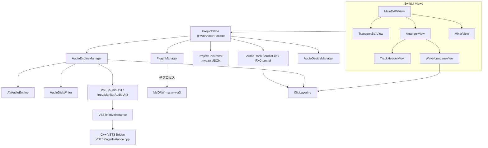

# MyDAW プロジェクト解析（v1.5）

> 対象バージョン: **1.5**（2026-09-28 時点のソース）
> 英語版: [PROJECT_ANALYSIS_en.md](PROJECT_ANALYSIS_en.md)
> 型・関数単位の詳細: [SOURCE_SPECIFICATION_jp.md](SOURCE_SPECIFICATION_jp.md)

本書は MyDAW のシステム全体を、構成・信号経路・スレッド設計・データ保存・設計判断・既知の制約の観点から説明します。ソースを初めて読む開発者が、どこに何があり、なぜそうなっているかを把握できることを目的とします。

---

## 1. 概要

MyDAW は Apple Silicon Mac 向けのマルチトラック・オーディオ録音／編集／ミキシング DAW です。SwiftUI（UI）と AVAudioEngine（音声処理）で構成され、VST3 ホスティングのみ C++（Steinberg VST3 SDK）で実装しています。

| 項目 | 内容 |
| --- | --- |
| 対象 | macOS 13 以上 / Apple Silicon |
| 言語 | Swift（UI・エンジン）、C++17 / Objective-C++（VST3 ブリッジ） |
| 音声基盤 | AVAudioEngine、Core Audio HAL、AUAudioUnit（v3 サブクラス） |
| 録音形式 | 24-bit Linear PCM WAV、44.1 / 48 kHz、モノラル／ステレオ |
| プラグイン | Audio Unit エフェクト、VST3 エフェクト（同名の AU がある VST3 は一覧から除外） |
| ソース規模 | Swift 約 11,000 行 / C++ 約 900 行（`Sources/` と `VST3Host/`） |
| ビルド | `./scripts/build.sh`（CMake で VST3 ブリッジを構築し `swiftc` でリンク） |

### 1.1 主な機能

- **録音**: トラックごとに入力チャンネル（モノ／ステレオ）を割当て、24-bit WAV へディスク直書き。録音位置はサンプル単位で補正。
- **パンチイン／アウト**: ルーラー上のパンチ範囲だけを録音。録音は通し全体を保存し、停止時にパンチ範囲へトリミング（前後の余白を保持）。
- **インプットモニタリング**: トラックの `I` ボタンで、入力をトラックのインサート・フェーダー・Send を通して試聴（録音は原音）。
- **クリップ編集**: 移動（トラック間含む）、左右トリム、ゲイン、直線フェード、分割、複製、削除、ミュート、UNDO／REDO、拍スナップ。
- **重なり処理（レイヤー）**: クリップが重なると後から追加したクリップが優先。境界は等パワー・クロスフェード。
- **ミキサー**: Studio One 風の 3 区画ストリップ（INSERT／SEND／コントロール）、dB フェーダー（最大 +6 dB）、ステレオ・ピークメーター、PAN、M／S、数値直接入力。
- **エフェクト**: トラック・FX チャンネル・マスターへ AU／VST3 を挿入。ポストインサート・ポストパンの Send。プラグイン遅延補正。
- **その他**: BPM・小節表示ルーラー、メトロノーム、マスター書き出し（24-bit WAV）、プロジェクト保存／読込、WAV 取り込み、トラック色変更。

---

## 2. ディレクトリとモジュール構成

```
MyDAW/
├── Sources/                    Swift ソース（アプリ本体）
│   ├── MyDAWApp.swift          @main、メニュー、終了処理、VST3 スキャン子プロセス分岐
│   ├── Models/                 ドメインモデル・状態・永続化
│   │   ├── ProjectState.swift      UI とエンジンの仲介（Facade）
│   │   ├── AudioTrack.swift        トラック（+ MixerGain, ChannelMode）
│   │   ├── AudioClip.swift         クリップ（タイムライン配置とファイル範囲）
│   │   ├── ClipLayering.swift      クリップ重なり・クロスフェード計算（純粋関数）
│   │   ├── FXChannel.swift         FX チャンネルと FXSend
│   │   ├── ProjectDocument.swift   .mydaw JSON の DTO 群
│   │   ├── StereoPeak.swift        L/R ピーク値
│   │   └── WaveformCache.swift     波形ピークキャッシュ
│   ├── Audio/                  音声エンジン・デバイス・プラグイン
│   │   ├── AudioEngineManager.swift  AVAudioEngine グラフ、再生、録音、メーター
│   │   ├── AudioDiskWriter.swift     WAV 非同期書き込み
│   │   ├── AudioDeviceManager.swift  Core Audio HAL（デバイス・チャンネル・バッファ）
│   │   ├── PluginManager.swift       AU／VST3 検出（VST3 は子プロセス＋キャッシュ）
│   │   ├── VST3AudioUnit.swift       VST3 を包むアプリ内 AUv3
│   │   ├── InputMonitorAudioUnit.swift 入力チャンネル抽出用アプリ内 AUv3
│   │   ├── VST3NativeInstance.swift  C++ VST3 インスタンスの Swift ラッパー
│   │   ├── VST3HostBridge.swift      VST3 列挙 API の Swift ラッパー
│   │   ├── VST3Host.swift            VST3 ホスト抽象（プロトコル）
│   │   └── GenericAUParameterView.swift  AU の汎用パラメータ UI
│   └── Views/                  SwiftUI 画面
│       ├── MainDAWView.swift         画面ルート、起動ログ、書き出しダイアログ、キー処理
│       ├── ProjectSelectionView.swift 起動時のプロジェクト選択
│       ├── TransportBarView.swift    トランスポート、表示倍率、オーディオ設定
│       ├── ArrangerView.swift        タイムライン、ルーラー、パンチ範囲
│       ├── TrackHeaderView.swift     トラックヘッダー、色パレット
│       ├── WaveformLaneView.swift    波形レーン、クリップ操作、重なり表示
│       ├── WaveformCanvas.swift      波形描画（SwiftUI Canvas）
│       ├── MixerView.swift           ミキサー（3 区画ストリップ）
│       ├── MixerControls.swift       フェーダー、PAN、メーター、dB スケール
│       └── WindowCloseHandler.swift  ウィンドウを閉じる際の保存確認
├── VST3Host/                   C++ VST3 ホストブリッジ（CMake で静的ライブラリ化）
├── ThirdParty/vst3sdk/         Steinberg VST3 SDK
├── scripts/build.sh, run.sh    ビルド／起動スクリプト（正式なビルド手順）
├── docs/                       本書、ソース仕様書、マニュアル原稿
└── snapshots/                  作業ごとのソーススナップショット（手動バックアップ）
```

> **注意**: `./scripts/build.sh` でも `MyDAW.xcodeproj` でも同じアプリができます。Xcode ターゲットは「Build VST3 Bridge」スクリプトフェーズ（CMake）を実行し、`OTHER_LDFLAGS` でブリッジと SDK の静的ライブラリをリンクし、署名の前に「Strip Extended Attributes」（`xattr -cr`）を実行します。どちらも arm64 のみ、アドホック署名、Hardened Runtime なしです。`Package.swift` は現行ソースに追従していません。

---

## 3. アーキテクチャ

### 3.1 レイヤー構成



- **UI → ProjectState**: 画面操作は原則 `ProjectState` のメソッドを呼び、`ProjectState` がモデルを更新して `AudioEngineManager.syncTracks` などでエンジンへ反映します。
- **ProjectState**: トラック・FX・マスター構成、UNDO／REDO、保存／読込、取り込み、書き出しの窓口です。
- **AudioEngineManager**: AVAudioEngine のノード構成（グラフ）と再生スケジュール、録音、メーター、プラグイン生成を担う中心クラスです（約 3,700 行）。
- **ClipLayering**: クリップ重なりの計算を純粋関数として切り出したもので、再生と画面表示が同じ計算を共有します。

### 3.2 オーディオ信号経路

#### トラック

```
クリップ用 AVAudioPlayerNode（クリップ1つにつき1ノード）
 ＋ InputMonitorAudioUnit（R と I が ON のときのみ）
      │
      ▼
トラック出力ミキサー（フェーダー音量）
      │
      ▼
インサート（AU / VST3AudioUnit を挿入順に直列）
      │
      ▼
PAN ミキサー（PAN を適用）
      │
      ▼
分岐ミキサー（★メーター計測点：ポストインサート・ポストフェーダー・ポストパン）
      ├──► mainMixer ──► MASTER
      └──► Send ゲインミキサー ──► 各 FX チャンネル入力
```

#### FX チャンネル

```
FX 入力ミキサー（FX 音量）→ インサート → PAN ミキサー → FX 出力ミキサー（★メーター）→ mainMixer
```

#### マスター

```
mainMixer → マスターボリュームミキサー → マスタープラグイン（POST）→ メーター用ミキサー（★メーター）→ 出力デバイス
```

#### 入力（録音）

```
inputNode（デバイスの全入力チャンネル）
  ├──► 入力タップ → チャンネル抽出 → AudioDiskWriter（WAV、原音）
  └──► InputMonitorAudioUnit（トラックごと、I ボタン ON 時）→ トラック出力ミキサー
```

### 3.3 VST3 ホスティング

VST3 は「アプリ内 AUv3」として AVAudioEngine のグラフへ組み込みます。

1. **検出**: `PluginManager` がバンドルごとに `MyDAW --scan-vst3 <path>` を子プロセスで起動し、JSON でクラス情報を受け取ります。結果は `~/Library/Application Support/MyDAW/vst3-scan-cache.json` に更新日時付きでキャッシュします。本体プロセスには検出時点で VST3 バイナリを読み込みません。
2. **重複除外**: 同名の AU が存在する VST3 は一覧から除外します（同一メーカーの AU／VST3 を同一プロセスへ同時に読み込むと衝突するため）。
3. **生成**: `VST3NativeInstance`（C++ `MyDAWVST3Create`）がモジュールを読み込み、コンポーネント・コントローラを初期化します。
4. **処理**: `VST3AudioUnit`（`AUAudioUnit` サブクラス）の `internalRenderBlock` がオーディオスレッド上で `MyDAWVST3ProcessStereo` を直接呼びます。AU と同じチェーンに挿入順で並びます。
5. **パラメータ**: `IComponentHandler` 実装が GUI の `performEdit` を受け、次ブロックで `inputParameterChanges` としてプロセッサへ渡します。
6. **状態**: `getState`／`setState` で保存・復元し、復元時はコントローラにも `setComponentState` を渡します。
7. **終了**: アプリ終了時にエディタを外し、全インスタンスを破棄してモジュールの `bundleExit` を実行させます。

### 3.4 スレッドモデル

| スレッド | 主な処理 | 同期手段 |
| --- | --- | --- |
| メイン（@MainActor） | UI、`ProjectState`、`AudioEngineManager` の公開 API、グラフ変更 | — |
| オーディオ描画スレッド | AVAudioEngine の描画、`VST3AudioUnit`／`InputMonitorAudioUnit` の render block | ロックなし（事前確保バッファ）、VST3 側のみ `std::mutex`（競合なし） |
| 入力タップスレッド | `processInputAudioBuffer`（ピーク計算、録音データ切り出し） | `captureLock`、`recordingTimingLock`、`peakLock` |
| 書き込みキュー | `AudioDiskWriter` の WAV 書き込み | シリアル `DispatchQueue` |
| メーター Timer（30 Hz） | ピーク集計、通知、パンチ状態更新 | `peakLock` |
| 子プロセス | VST3 スキャン | 標準出力（JSON） |

### 3.5 データ保存

- プロジェクトは **フォルダー単位**（`MySong/MySong.mydaw` + `MySong/Recordings/*.wav`）。
- `.mydaw` は JSON（`ProjectDocument` バージョン 4）。音声は WAV への相対パスで参照し、埋め込みません。
- AU の状態は `fullStateForDocument` を binary plist 化、VST3 の状態は `getState` のバイト列を `format: "vst3-state"` で保存します。
- 新しい項目（`isInputMonitoring` など）は `decodeIfPresent` で後方互換を保ちます。
- ミキサーの区画の高さなど画面設定は `UserDefaults`（アプリ共通）に保存します。

---

## 4. 主要処理フロー

### 4.1 再生開始

1. `startPlayOrRecord` → プラグイングラフの準備完了を待つ（`isPluginGraphReady`）。
2. 共通開始時刻（現在 + 50 ms の hostTime）を決定。
3. 各トラックについて `scheduleClips`：
   - `ClipLayering.segments` でクリップを「そのまま／隠れる／整形」区間に分割。
   - そのまま区間は `scheduleSegment`（ファイル直接）、整形区間はゲイン・フェード・クロスフェードを掛けたバッファを `scheduleBuffer`、隠れる区間は予約しない。
   - 時刻は明示的なサンプル時刻で指定し、区間の継ぎ目を連続させる。
   - プラグイン遅延分だけ前倒しで予約。
4. 予約したクリップノードのみ `play(at:)`（不要なノードを起動しないことで開始処理を短縮）。
5. メトロノームとプレイヘッドタイマーを同じ開始時刻で起動。

### 4.2 録音

1. 録音ボタン → armed トラックごとに `AudioDiskWriter` を作成し、新規クリップを追加。
2. 入力タップ（約 100 ms 単位のバッファ）ごとに、バッファの hostTime から各サンプルのタイムライン位置を計算し、再生開始前の部分をサンプル単位で切り捨てて WAV に書き込む。
3. 録音中は録音対象トラックの既存クリップをミュート（パンチ時は範囲内のみ）。
4. 停止 → writer を確定し、クリップのメタデータを読み込む。パンチ録音なら範囲へトリミングし 10 ms のフェードを付与。
5. クリップ位置 = 開始位置 − 録音遅延補正（入出力遅延 + バッファ + 手動補正 + マスタープラグイン遅延）。

### 4.3 クリップの重なり（ClipLayering）

- トラック内のクリップ配列の後ろ（後から追加）ほど上のレイヤー。
- 上のクリップが鳴っている区間では下のクリップは無音。上のフェードイン／アウトの区間は下が逆のカーブで出入りするクロスフェードになる。
- フェードが下のクリップの音と重なる場合は等パワー（sin/cos）、無音に対するフェードは直線。
- 重なっている側の下のクリップのフェードハンドルは表示しない（操作不可）。
- すべて位置から毎回計算するため、上のクリップを移動・削除すると下は自動的に元に戻る。

### 4.4 ミキサー操作

- フェーダー・PAN・Send の変更は `updateMixerLevels`／`setSend` から各ミキサーノードへ即時反映。
- 音量変更時はミキサーを `reset()` して音量の移行（ランプ）を即時完了させる（無音の入力でランプが止まり、次の発音で旧音量が漏れる問題への対策）。
- ソロ・ミュートはトラック出力ミキサーの音量で実現。

---

## 5. 設計判断と得られた知見

v1.4〜1.5 の開発で判明した AVAudioEngine／プラグインの落とし穴と、その対策です。改修時に同じ問題を再発させないために記録します。

| 事象 | 原因 | 対策 |
| --- | --- | --- |
| 途中再生で VST3 トラックが約 400 ms 遅れる | `at: nil` で予約したバッファが開始時刻を過ぎて届くとずれたまま鳴る。メインスレッドの大量 `play(at:)` とロック競合 | 全チャンクを明示時刻で予約。その後 VST3 をアプリ内 AUv3 化してリアルタイム処理へ移行 |
| 起動時にまれに異常終了（-10865） | 描画リソース確保済みの AU に異なるフォーマットで再接続 | `connectReformatting` で先に `deallocateRenderResources` |
| AU／VST3 同居で衝突・異常終了 | 同一メーカーの AU と VST3 が同じ ObjC クラスや共有ライブラリを持つ | VST3 スキャンは子プロセス、同名 AU がある VST3 は非表示 |
| VST3 の GUI 変更が音に反映されない | `IComponentHandler` 未実装で `inputParameterChanges` を渡していなかった | ハンドラを実装し毎ブロック受け渡し |
| インプットモニターで入力が止まる | 実行中の 1 対多接続がフォーマットを無視し 44.1 kHz のミキサーが残る → 513 フレームの描画要求を入力が拒否 | 分岐の張り替えはエンジン停止中に行う（再生中は停止時まで保留） |
| ソロ時に一瞬音が漏れる | 無音入力ではミキサーの音量ランプが進まない | 音量変更後にミキサーを `reset()` |
| 録音が約 100 ms 遅れる | 最初のタップバッファの再生開始前部分を丸ごと書き込んでいた | hostTime からサンプル単位でトリミング |
| PAN がメーター・インサート付きトラックに効かない | AVAudioMixing の PAN はミキサーへの接続にしか効かない | インサート後に PAN 専用ミキサーを配置 |
| 終了時に Guitar Rig 7 が異常終了 | VST3 モジュールの `bundleExit` 未実行のまま `exit()` | 終了時に VST3 インスタンスを破棄 |

---

## 6. 既知の制約

- **ビルド**: `Package.swift` は現行ソースに追従していない。`./scripts/build.sh` か `MyDAW.xcodeproj` を使用すること。
- **VST3 のサンプルレート**: VST3 インスタンスは生成時のサンプルレートで動作する。プロジェクトを開いたままデバイスのサンプルレートを変えると、プラグインを挿し直すまで正しく処理されない。
- **44.1 kHz 素材の整形区間**: デバイスと異なるレートの素材（通常は取り込み時に拒否される）では、整形区間とそれ以外で変換処理が分かれるため継ぎ目にごく小さな段差が出る可能性がある。
- **Relab LX480**: AU の複数カスタム GUI でハングする既知の制約があり、複数インスタンス時は Generic UI を使用する。
- **VST3 インストゥルメント**: 対象外（エフェクトのみ）。
- **インプットモニターの遅延**: バッファサイズに依存（48 kHz・512 フレームで往復約 25〜30 ms）。ギター用途では 128〜256 を推奨。オーディオインターフェースのダイレクトモニターとの併用は二重に聞こえる。
- **ミキサー変更と再生中のグラフ変更**: プラグインの挿入・削除・並べ替えは停止中のみ。

---

## 7. 改善候補

### 優先度高
1. `Package.swift` の更新または削除（Xcode プロジェクトは v1.5 で更新済み）。
2. デバイスのサンプルレート変更時に VST3 インスタンスを再生成。
3. 自動テストの整備（`ClipLayering`、dB 変換、録音トリミングなど純粋ロジックから）。

### 優先度中
1. `AudioEngineManager`（約 3,700 行）の分割（グラフ構築、再生スケジュール、録音、メーターを別型へ）。
2. プロジェクト保存の堅牢化（原子的書き込み、自動保存）。
3. クリップの複数選択、トラックの並べ替え。
4. 整形区間の変換を一本化し、異なるサンプルレート素材の継ぎ目を解消。

### 優先度低
1. MIDI・インストゥルメント対応。
2. オートメーション。
3. プラグインの別プロセス実行（衝突・クラッシュ耐性）。

---

## 8. 開発・検証の進め方

- 変更前後で `snapshots/<名前>-<日時>/` にソースを保存する運用（Git は未使用）。
- ビルドは `./scripts/build.sh`。Google Drive 上でビルドする場合、署名前に拡張属性を除去する処理を含む。
- 実行時ログの取得: 標準出力はバッファされるため、診断はファイル出力が確実。`NSLog` はシステムログで読めない場合がある。
- 音声タイミングの問題は、推測で直さず、共通時計でのタイムスタンプ計測やグラフ構成のダンプで事実を確認してから修正する。
