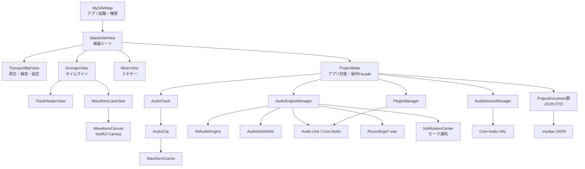

# MyDAW ソースコード仕様書

本書は `Sources/` 配下の Swift ソースを実装に基づいて説明する仕様書です。画面仕様ではなく、各ファイルの責務、型、プロパティ、関数・メソッドの契約、副作用を記載します。

## 1. 全体構造

### レイヤーとデータの流れ

| 層 | 主な型 | 役割 |
| --- | --- | --- |
| 起動 | `MyDAWApp` | アプリ生成、権限、メニュー、共有状態の注入 |
| UI | `MainDAWView`、各 View | ユーザー操作を `ProjectState` と `AudioEngineManager` に渡す |
| 状態 | `ProjectState` | トラック、編集履歴、保存、読込、ミキサー操作を統括 |
| モデル | `AudioTrack`、`AudioClip`、`FXChannel` | DAWの編集可能なドメインデータを保持 |
| 音声 | `AudioEngineManager`、`AudioDiskWriter` | 再生、録音、ミックス、メーター、WAV出力 |
| デバイス/プラグイン | `AudioDeviceManager`、`PluginManager` | Core AudioデバイスとAudio Unitの列挙・適用 |
| 永続化 | `ProjectDocument`群 | `.mydaw` JSONへ編集状態を保存。音声本体はWAV参照 |

録音時は `AVAudioEngine` の入力タップがバッファを受け取り、armedトラックごとに入力チャンネルを抽出します。モノラル録音は1ch、ステレオ録音は指定したInput 1/2などの2chをWAVへ保存します。音声は `AudioDiskWriter` が非同期でWAVへ書き、録音中のピークはチャンネル別に `MyDAWNotificationCenter` を経由して `ProjectState` と画面へ通知されます。再生時はクリップを `AVAudioPlayerNode` にスケジュールし、トラック、FX、マスターのノードをミックスします。モノラル再生バッファは2ch出力形式へ正規化し、左右へ同じ信号を出力します。

> 注意: READMEなどにある「Metal波形レンダラー」という説明に対し、現在の実装は `WaveformCanvas` の SwiftUI `Canvas` です。独自Metalシェーダーは `Sources` にありません。

## 2. アプリケーション

### `Sources/MyDAWApp.swift`

#### `MyDAWApp: App`

- **責務**: アプリのエントリーポイント。`ProjectState` を `@StateObject` として生成し、`MainDAWView` へ注入する。
- **プロパティ**: `projectState: ProjectState`。アプリ全体で共有する状態。
- **`init()`**: `requestAudioPermissions()` を呼び、マイク権限の要求を開始する。
- **`body`**: `WindowGroup`、メニュー、保存・読込・マスター書出し、Undo/Redoのコマンドを構築する。
- **`requestAudioPermissions()`**: macOSのバージョンに応じて `AVAudioApplication` または `AVCaptureDevice` のマイク権限APIを呼ぶ。OSの権限ダイアログという副作用がある。

## 3. モデル

### `Sources/Models/AudioTrack.swift`

#### `ChannelMode: String, Codable, CaseIterable`

- **値**: `.mono`、`.stereo`。
- **`id`**: UI識別子として raw value を返す。
- **`channelCount`**: monoは1、stereoは2を返す。

#### `AudioTrack: Identifiable, ObservableObject`

トラック名、録音状態、ミキサー値、クリップ、プラグイン、FX送信を所有する参照型です。

- **主なプロパティ**: `id`、`name`、`channelMode`、`inputChannelIndex`、`isRecordArmed`、`isMuted`、`isSoloed`、`volume`、`pan`、`trackHeight`、`color`、`audioFileURL`、`clips`、`plugins`、`fxSends`、`selectedClipId`、`currentInputPeak`、`currentOutputPeak`。
- **`init(...)`**: トラックを初期化する。音声URLが指定された場合は初期クリップを作り、メタデータを読み込む。
- **`isRecordingMode`**: `isRecordArmed` を返す計算プロパティ。
- **`addClip(startTime:fileURL:) -> AudioClip`**: クリップを追加し、最後に追加した音声URLを `audioFileURL` に反映する。
- **`appendLivePeaks(_:)` / `appendLiveChannelPeaks(_:)`**: 最後のクリップへ録音中の合成ピークまたはチャンネル別ピーク列を追加する。
- **`moveClip(id:to:)`**: 指定クリップの開始位置を0秒以上に補正して更新する。
- **`deleteClip(id:removeFile:)`**: クリップを削除する。要求時、他クリップから参照されていない音声ファイルも削除する。
- **`duplicateClip(id:) -> AudioClip?`**: クリップを直後の位置へ複製する。対象がなければ `nil`。
- **`splitClip(id:at:) -> Bool`**: クリップを指定位置で分割する。極端に短い分割は拒否し、成功可否を返す。
- **`insertPlugin(_:)` / `removePlugin(id:)`**: プラグインを追加・削除する。同一IDの追加は既存項目を有効化する。
- **`restoreClip(_:)` / `replaceClips(_:)`**: 保存データやUndoスナップショットからクリップを復元・置換する。

### `Sources/Models/AudioClip.swift`

#### `AudioClip: Identifiable, ObservableObject`

タイムライン上の配置と、WAVファイル内の再生範囲を表します。

- **プロパティ**: `id`、`startTime`、`sourceStartTime`、`gainDB`、`fadeInDuration`、`fadeOutDuration`、`fileURL`、`duration`、`originalDuration`、`waveformCache`。
- **`init(id:startTime:fileURL:)`**: 開始位置を0秒以上に補正してクリップを作る。
- **`loadMetadata()`**: `AVAudioFile` からサンプルレートとフレーム長を取得し、波形ピークの非同期読込を開始する。
- **`appendLivePeaks(_:)` / `appendLiveChannelPeaks(_:)`**: 録音中のピークを `WaveformCache` に追加する。
- **`setTrim(startTime:sourceStartTime:duration:)`**: タイムライン位置、ソース開始位置、長さを更新する。長さは最低値で制限される。
- **`setGainDB(_:)`**: クリップゲインを -24〜+24 dBへ制限する。
- **`setFadeInDuration(_:)` / `setFadeOutDuration(_:)`**: 直線フェード長を0秒以上、クリップ長以下へ制限する。
- **`duplicate(at:) -> AudioClip`**: 同じ音声ファイルを参照する新しいクリップを指定位置に作る。

### `Sources/Models/WaveformCache.swift`

#### `PeakPoint`

波形の一定サンプル区間を表す値型。`id`、`min`、`max` を持つ。

#### `WaveformCache: ObservableObject`

WAVを描画用の最小値・最大値列へ変換します。

- **プロパティ**: `peaks`（合成ピーク）、`channelPeaks`（チャンネル別）、`isLoading`、`duration`、`samplesPerPeak`。
- **`init(samplesPerPeak:)`**: 1ピークあたりのサンプル数を設定する。既定値は512。
- **`clear()`**: キャッシュと時間情報を消去する。
- **`peaks(for:) -> [PeakPoint]`**: チャンネル指定時は該当列、指定なしでは合成列を返す。
- **`appendLivePeak(min:max:)` / `appendLivePeaks(_:)` / `appendLiveChannelPeaks(_:)`**: 録音中の合成またはチャンネル別ピークを追加し、値を `-1...1` に制限する。
- **`loadPeaks(from:sampleRate:)`**: `Task.detached` で `AVAudioFile` を読み、一定サンプル区間ごとのチャンネル別 min/max を計算する。公開状態の更新は `MainActor` で行う。

### `Sources/Models/FXChannel.swift`

#### `FXChannel: Identifiable, ObservableObject`

リバーブなどのエフェクトリターンを表します。`id`、`name`、`volume`、`pan`、`plugins`、`color` を持ちます。

- **`init(...)`**: FXチャンネルを初期化する。
- **`insertPlugin(_:)` / `removePlugin(id:)`**: FXチェーンのプラグインを追加・削除する。同一IDなら有効化する。

#### `FXSend: Identifiable, Codable, Hashable`

トラックからFXチャンネルへの送信設定。`id`、`fxChannelID`、`level`、`enabled` を持つ。

### `Sources/Models/ProjectDocument.swift`

`.mydaw` JSONのDTOです。音声データそのものではなく、WAVファイルのパスを保存します。

- **`PluginStateDocument`**: `pluginID`、`stateData`、`format` を保持。Audio Unit状態をbinary plistデータとして保存する。`init(pluginID:stateData:format:)` で生成。
- **`ProjectDocument`**: バージョン、ズーム、選択、プレイヘッド、BPM、メトロノーム、マスター音量、表示倍率、トラック、FX、プラグイン、プラグイン状態を保持する。`init(...)` は現行バージョン4で生成し、`init(from:)` は旧ファイルの欠落項目へ既定値を補う。
- **`TrackDocument`**: トラックのID、名称、チャンネル、録音・ミュート・ソロ、音量、パン、高さ、色、クリップ、プラグイン、FX送信を保持する。`init(...)` と後方互換用 `init(from:)` を持つ。
- **`FXChannelDocument`**: `init(channel:)` で `FXChannel` を永続化用データへ変換する。
- **`ClipDocument`**: クリップID、タイムライン位置、ソース位置、長さ、元の長さ、ゲイン、フェードイン／アウト長、ファイルパスを保持する。旧形式ではフェード値を0として読み込む。
- **`ColorDocument`**: `red`、`green`、`blue`、`opacity` を保持する。`init(color:)` で SwiftUI `Color` をRGBへ変換し、`color` で復元する。

### `Sources/Models/ProjectState.swift`

`ProjectState: ObservableObject` はUIと音声エンジンの間に立つアプリケーションサービスです。`@MainActor` 上で動作します。

- **状態**: `tracks`、`fxChannels`、`masterPlugins`、`selectedTrackId`、`pixelsPerSecond`、`timelineScrollTime`、`showsBeats`、`snapToGrid`、波形・トラック高さ倍率、Undo/Redo可否、保存・書出し状態、`pluginManager`、`audioEngine`、`deviceManager`。
- **`audioContentEndTime`**: 全クリップの `startTime + duration` の最大値を返す。
- **`init(audioEngine:deviceManager:pluginManager:)`**: 依存オブジェクトを生成または受け取り、ピーク通知を購読し、初期トラック2本を作る。
- **Undo/Redo**: `beginClipEdit()` が編集前スナップショットを保持し、`endClipEdit()` が履歴へ登録する。`undo()`、`redo()` は再生・録音中は何もしない。privateな `makeClipEditSnapshot()`、`recordClipEdit()`、`updateHistoryAvailability()`、`restoreClipEditSnapshot(_:)` が履歴を支える。
- **トラック**: `addTrack(name:mode:isArmed:)`、`deleteTrack(id:)`、`toggleRecordArm(for:)`、`toggleMute(for:)`、`toggleSolo(for:)`。状態変更後は音声エンジンを同期する。
- **クリップ**: `selectClip(trackId:clipId:)`、`deleteSelectedClip()`、`deleteClip(trackId:clipId:)`、`duplicateClip(trackId:clipId:)`、`splitSelectedClip()`、`splitClip(trackId:clipId:)`。編集操作はUndo対象になる。
- **ファイル**: `importAudioFile(_:intoTrackId:)` はサンプルレートと24-bitを検証し、管理対象の録音フォルダへコピーしてクリップ化する。`saveProject() -> Bool` は `NSSavePanel` と `ProjectDocument` でJSON保存する。`loadProject()` はJSON、WAVメタデータ、波形、Audio Unit状態を復元する。privateな `managedRecordingURL(for:)`、`presentProjectError(_:)` が補助する。
- **マスター書出し**: `beginMasterExportDialog()`、`exportMasterMix(startTime:endTime:)`、`cancelMasterExport()`。書出し処理は `AudioEngineManager` に委譲し、進行・完了・エラーを公開状態へ反映する。
- **プラグイン/FX**: `insertPlugin(_:into:)`、`removePlugin(_:from:)`、`addFXChannel()`、`removeFXChannel(id:)`、`setSend(trackID:fxChannelID:level:)`、`insertPlugin(_:intoFX:)`、`removePlugin(_:fromFX:)`、`insertMasterPlugin(_:)`、`removeMasterPlugin(_:)`、`openPluginUI(_:on:)`。
- **表示/時間**: `zoomIn()`、`zoomOut()`、`setPixelsPerSecond(_:)` は倍率を20〜400へ制限する。`snappedTimelineTime(_:)` はBPMに基づくグリッド時刻を返す。privateな `setupPeakObserver()` と `updateMixerLevelsAfterTrackControlChange()` がメーター・ミキサー同期を行う。

## 4. 音声・デバイス・プラグイン

### `Sources/Audio/AudioDeviceManager.swift`

#### `AudioInputChannelOption` / `AudioDeviceOption`

入力選択UI用の `id`、`channelOffset`、`name`、`isStereo` と、Core Audioデバイス用の `id`、`name` を保持する値型です。

#### `AudioDeviceManager: ObservableObject`

Core Audio HALからデバイス、チャンネル数、サンプルレート、バッファサイズを読み書きします。

- **状態**: `deviceName`、`availableMonoChannels`、`availableStereoChannels`、`hardwareInputChannelCount`、`hardwareSampleRate`、`bufferFrameSize`、`inputDevices`、`outputDevices`、選択中デバイスID。
- **`init()`**: `refreshHardwareInfo()` を実行する。
- **`refreshHardwareInfo()`**: 入出力デバイス、既定デバイス、入力チャンネル、サンプルレート、バッファサイズを取得して候補を再構築する。
- **`channels(for:)`**: mono/stereoのモードに対応する入力候補を返す。
- **`setBufferFrameSize(_:) -> Bool`**: 128〜4096へ制限したバッファサイズを入出力デバイスへ適用し、成功可否を返す。
- **private**: `defaultDevice(selector:)`、`allAudioDevices()`、`deviceName(for:)`、`hasChannels(_:scope:)`、`readBufferFrameSize(for:)` はHAL問い合わせを分担する。

### `Sources/Audio/AudioDiskWriter.swift`

#### `AudioDiskWriter: @unchecked Sendable`

録音中のPCMバッファを専用キューでWAVへ書き込み、リアルタイム音声スレッドの待ち時間を抑えます。

- **状態**: 出力 `fileURL`、`sampleRate`、`channelCount`、24-bit設定、書込みキュー、`totalFramesWritten`、`isFinalized`。
- **`init(destinationDirectory:trackId:trackName:sampleRate:channelCount:is24Bit:)`**: ファイル名と24-bit Linear PCM WAV形式を決め、出力ファイルを作成する。
- **`write(buffer:)`**: PCMバッファをコピーして非同期キューへ投入する。呼出元の音声スレッドではディスクI/Oを待たない。
- **`finalize() async -> URL?`**: 保留中の書込みを待ち、ファイルを確定して生成URLを返す。

### `Sources/Audio/PluginManager.swift`

- **`TrackPluginKind`**: `.au`、`.vst3`。現実装の検出・生成はAudio Unit中心。
- **`PluginUICompatibility`**: `automatic`、`custom`、`customMainThread`、`genericOnly`、`disabled`。UI表示方式を表す。
- **`PluginCompatibilityProfile`**: UI互換性、要求タイムアウト、注記をまとめ、`automatic` で既定プロファイルを作る。
- **`TrackPluginDescriptor`**: ID、名称、種類、bundle URL、Audio Component識別子、flags、有効状態、互換性を保持する。`isLoadable` はAUかつcomponent typeが有効かを返し、`audioComponentDescription` はCore Audio用構造体を生成する。`init(...)`、`newInstance()`、`init(from:)` を持つ。
- **`PluginManager: ObservableObject`**: `availablePlugins` を所有する。`init()` は列挙を開始し、`discoverAvailablePlugins()` は重複除去・名前順整理を行う。`discoverAUComponents()` は `AudioComponentFindNext` でAUを列挙し、`instantiateAudioUnit(for:completion:)` は `AVAudioUnit.instantiate` で非同期生成する。

### `Sources/Audio/AudioEngineManager.swift`

#### `MyDAWNotificationCenter`

`shared` にアプリ内通知用の `NotificationCenter` を提供します。ピーク通知名 `.audioEngineUpdatedPeaks` がUI更新に使われます。

#### `TrackCaptureConfig`

リアルタイムスレッドへ渡す録音設定。`trackId`、`isArmed`、`channelOffset`、`isStereo` を持ち、`@unchecked Sendable` です。

#### `AudioEngineManager: ObservableObject`

AVAudioEngineのグラフ、再生、録音、メトロノーム、メーター、Audio Unit、マスター書出しを管理します。`@MainActor` 上で公開操作を受け、入力タップとロックでリアルタイム処理と状態を分離します。

- **公開状態**: `engine`、`isPlaying`、`isRecording`、`currentTime`、`bpm`、メトロノーム3項目、`hardwareSampleRate`、`sampleRate`、`masterVolume`、`masterPeak`、`recordingsDirectory`、入力チャンネル数、入力有効状態、入力バッファサイズ、手動録音補正、選択中の入出力デバイスID。Core Audio遅延の診断値は内部状態として取得するが、設定ダイアログには表示しない。
- **初期化/保存先**: `init()` は録音フォルダ解決、`setupEngine()`、メータータイマー開始を行う。`revealRecordingsFolder()` はFinderを開く。`chooseRecordingsDirectory() -> Bool` と `setRecordingsDirectory(_:) -> Bool` は録音先を変更して `UserDefaults` へ保存する。private `resolveRecordingsDirectory()` は保存済みパス、アプリ周辺、カレント、Musicフォルダの順で探索する。
- **エンジン設定**: `applyInputBufferFrameSize(_:)`、`applyAudioDevices(inputDeviceID:outputDeviceID:) -> Bool` はハードウェア設定を適用する。`prepareForPluginGraphRestore()`、`setSavedPluginStates(_:)`、`capturePluginStates()` はAudio Unit状態の復元・保存を支える。`commitBPM(_:)` はBPMを20〜400へ制限する。
- **グラフ同期**: `syncTracks(_:)`、`syncTracks(_:fxChannels:)`、`syncTracks(_:fxChannels:masterPlugins:)` はトラック、FX、マスターのノード構成を再構築・同期する。`syncMasterPlugins(_:)`、`updateMixerLevels(tracks:fxChannels:)`、`updateSendLevel(track:send:fxChannel:anySolo:)` はプラグインチェーンまたは再生中の音量・パン・ミュート・ソロ・送信を更新する。`openPluginUI(pluginID:)` はAudio UnitのUIを表示する。
- **トランスポート**: `startPlayOrRecord(tracks:fxChannels:)` は再生中なら停止し、準備済みグラフから再生または録音を開始する。`stop(tracks:)` は停止してWAVを確定する。`rewind(tracks:)` は停止して0秒へ戻し、`seek(to:tracks:fxChannels:)` は指定位置へ移動する。
- **書出し**: `exportMasterMix(to:startTime:endTime:tracks:fxChannels:) async throws` はマスター出力を24-bit WAVへ書き出す。
- **privateな音声処理**: `setupEngine()`、`reconfigureEngine()`、`warmUpAudioRenderPath(format:)`、`processInputAudioBuffer(buffer:)`、`startMeterTimer()`、`startPlayback(tracks:)`、`scheduleClips(for:player:startSec:compensatePluginLatency:)`、`makeClipPlaybackBuffer(...)`、`startRecording(armedTracks:playbackTracks:)`、`startPlayheadTimer()`、`stopPlayheadTimer()` が入力抽出、再生スケジュール、ゲイン／フェード適用、録音、プレイヘッドを分担する。
- **privateなメトロノーム/プラグイン処理**: `makeClickBuffer(format:frequency:amplitude:)`、`makeSilentBuffer(format:duration:)`、`startMetronome()`、`stopMetronome()`、`installMasterAudioUnits(...)`、`isPluginGraphReady(...)`、UI表示補助群が担当する。クリックは再生・録音中のUI切替を禁止する。
- **並行性**: `NSLock` で録音設定、WAV writer、ピーク値を保護する。Timer、Task、DispatchQueue、Audio Unit UIウィンドウを使用するため、停止・キャンセル・確定処理が重要なライフサイクル境界となる。

## 5. SwiftUIビュー

### `Sources/Views/MainDAWView.swift`

- **`MainDAWView`**: `TransportBarView`、`ArrangerView`、`MixerView`、ステータスバー、書出しダイアログ、`WindowCloseHandler`、`SpacebarHandler` を配置する。`init(projectState:)` は共有状態を受け取り、`body` は全体レイアウトを返す。
- **`MasterExportDialog`**: 開始・終了秒を入力し、`ProjectState.exportMasterMix` を呼ぶ。進行中、完了、エラーを表示する。
- **`SpacebarHandler: NSViewRepresentable`**: `makeCoordinator()`、`makeNSView(context:)`、`updateNSView`、`dismantleNSView` でAppKitのイベント監視をSwiftUIへ橋渡しする。
- **`SpacebarHandler.Coordinator`**: `startMonitoring()` はSpace、左矢印、R、Command-Z系を処理し、`stopMonitoring()` はイベントモニターを解除する。

### `Sources/Views/TransportBarView.swift`

- **`TransportBarView`**: 再生・停止・録音、Undo/Redo、保存・読込、メトロノーム、ズーム、BPM、マスター音量を操作する。`timeString` は時分秒ミリ秒、`barBeatString` はBPM基準の小節・拍を返す。`commitBPMText()` は入力BPMをエンジンへ反映し、`body` は操作UIを構築する。
- **`BufferSettingsView`**: 録音フォルダ、入出力デバイス、バッファサイズ、レイテンシー補正、クリック補正、メトロノーム音量を設定する。`commitRecordingCompensation()` と `commitClickTimingOffset()` は入力値をエンジンへ反映する。

### `Sources/Views/ArrangerView.swift`

- **`TimelineScrollOffsetKey: PreferenceKey`**: `defaultValue` と `reduce(value:nextValue:)` で横スクロール位置を親へ渡す。
- **`ArrangerView`**: トラックヘッダー、波形レーン、ルーラー、プレイヘッド、横スクロールを配置する。`timelineWidth` はズーム、プレイヘッド、クリップ終端から必要幅を計算し、`body` は自動スクロールと削除キー処理を接続する。
- **`TimelineRulerView`**: `body` で秒または小節・拍の目盛りを `Canvas` 描画し、クリック/ドラッグを `seek` へ渡す。
- **`Triangle: Shape`**: `path(in:)` でプレイヘッド上端の三角形を描く。

### `Sources/Views/TrackHeaderView.swift`

#### `TrackHeaderView`

トラック名、mono/stereo、R/M/S、入力チャンネル、入力/出力メーター、トラック高さを操作します。

- **`init(track:projectState:isSelected:)`**: 表示対象と共有状態を受け取る。
- **`rowHeight(for:)`**: トラック高さ倍率を適用し、最低120ptを保証する。
- **`body`**: 編集、録音アーム、ミュート、ソロ、入力選択、選択状態、フェーダー類をSwiftUIで構築する。

### `Sources/Views/WaveformLaneView.swift`

- **`WaveformLaneView`**: 1トラック分の背景、グリッド、クリップ、Dropを担当する。`init(track:projectState:timelineWidth:)` でレイアウト情報を受け、`body` のファイルDropは `ProjectState.importAudioFile` を呼ぶ。
- **`AudioClipView`**: クリップの選択、移動、複製、分割、削除、波形描画、左右トリムを担当する。`trimHandle` は操作ハンドル、`leftTrimGesture` と `rightTrimGesture` はソース範囲とタイムライン範囲を更新し、`resetResizeState()` はドラッグ状態を初期化する。

### `Sources/Views/WaveformCanvas.swift`

#### `WaveformCanvas`

`WaveformCache` のピーク列を `Canvas` 上に上下対称のPathとして描画します。`waveformCache`、`trackColor`、`sampleRate`、`pixelsPerSecond`、`sampleOffset`、`visibleDuration`、`channelIndex`、`verticalScale` を入力として持ち、`init(...)` が値を受け、`body` が塗りと輪郭を描画します。GPU専用Metal実装ではありません。

### `Sources/Views/MixerView.swift`

- **`MixerView`**: トラック、FX、マスターを横スクロール式に表示する。`init(projectState:)` で共有状態を受け、`body` がミキサーを構築し、FX追加UIから `addFXChannel` を実行する。
- **`MasterChannelView`**: マスター音量、マスターメーター、マスタープラグイン追加・削除・UI表示を提供する。

### `Sources/Views/WindowCloseHandler.swift`

- **`WindowCloseHandler: NSViewRepresentable`**: `makeNSView(context:)`、`updateNSView`、`makeCoordinator()` でSwiftUIビューとAppKitウィンドウを接続する。
- **`Coordinator: NSObject, NSWindowDelegate`**: `attach(to:)` でdelegateを登録する。`windowShouldClose(_:)` は保存/破棄/キャンセルの確認を表示し、保存成功または破棄時に `closeWindow()` を呼ぶ。`closeWindow()` はウィンドウを閉じ、次のRunLoopでアプリを終了する。

## 6. 代表的な処理シーケンス

### 録音

1. UIが `ProjectState.toggleRecordArm(for:)` を呼ぶ。
2. `startPlayOrRecord` が `AudioEngineManager.startRecording` を開始する。
3. 入力タップの `processInputAudioBuffer` がarmedトラックのチャンネルを抽出する。
4. `AudioDiskWriter.write` が非同期でWAVへ保存し、同時にライブピークを蓄積する。
5. メータータイマーがピーク通知を送り、`ProjectState.setupPeakObserver` がトラックと波形を更新する。
6. `stop` が writer を `finalize` し、クリップのファイルURLと長さを確定する。

### 保存・読込

1. `ProjectState.saveProject()` が状態を `ProjectDocument` 以下のDTOへ変換する。
2. JSONには編集状態とWAVのパスを書き込む。
3. `loadProject()` がDTOを復元し、`AudioClip.loadMetadata()` と `WaveformCache.loadPeaks` を再実行する。
4. 保存済みAudio Unit状態を `AudioEngineManager` へ渡し、音声グラフを再構築する。

## 7. 仕様上の境界と注意点

- 対象プラットフォームは macOS 13 以上で、AVFoundation、Core Audio、AppKit、SwiftUIに依存する。
- 音声処理は `@MainActor` の公開状態とリアルタイム音声スレッドをまたぐため、直接UI状態を更新せず通知・ロック経由で連携する。
- `.mydaw` はWAVファイルを内包しないため、ファイルパスが移動・削除されるとクリップを再生できない。
- 保存・読込、録音停止、Audio Unit復元、デバイス変更はエラー処理とキャンセル処理の影響が大きい境界である。